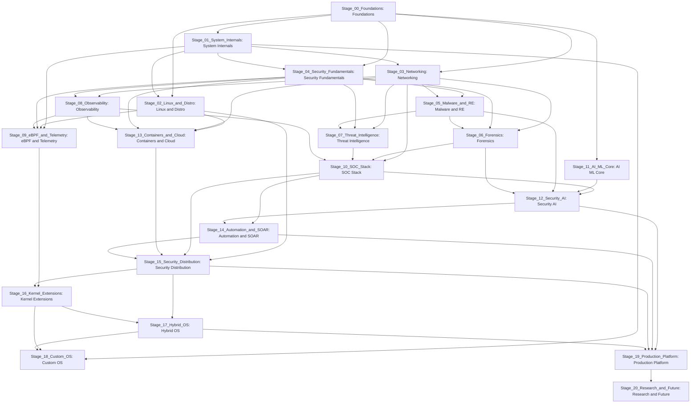

# Dependency Graph

## Circular Dependencies

None detected. Dependency edges only point to earlier or same conceptual prerequisites; generated stage graph is acyclic.

## Dependency Bottlenecks

- Stage_00_Foundations: blocks all technical branches.
- Stage_01_System_Internals: blocks Linux/distro, kernel telemetry, kernel extensions, custom OS.
- Stage_03_Networking: blocks detection, forensics, threat intelligence, observability, cloud.
- Stage_10_SOC_Stack: blocks Security AI, SOAR, production platform.
- Stage_15_Security_Distribution and Stage_16_Kernel_Extensions: block Hybrid OS and Custom OS convergence.
