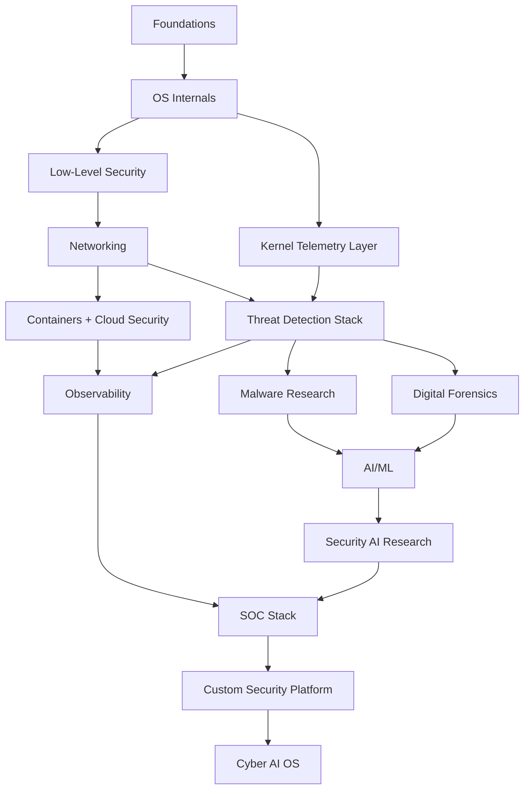

# Cyber AI OS Research Map

## Project Definition

This project is not only an operating system.

It is:

```text
OS Engineering
  + SOC Platform
  + EDR/XDR
  + AI Security Assistant
  + Forensics Suite
  + Threat Intelligence
  + Telemetry Kernel
  + Research Environment
```

The end target is a security ecosystem that can eventually become a cybersecurity-focused OS.

## Research Path

```text
Foundations
  -> OS Internals
  -> Security Engineering
  -> Networking
  -> Threat Detection
  -> Digital Forensics
  -> AI/ML
  -> Kernel Telemetry
  -> Cloud + Containers
  -> SOC Stack
  -> Custom Security Platform
  -> Cyber AI OS
```

## Dependency Graph



## 1. Operating System Engineering

### Topics

```text
Computer architecture
CPU modes
Privilege rings
Memory hierarchy
Caches
NUMA
Paging
Segmentation
Interrupts
DMA
MMU
TLB
Context switching
Process scheduling
IPC
Virtual memory
Filesystems
Boot process
ELF loading
UEFI
ACPI
Kernel modules
Device drivers
HAL
Syscalls
Kernel debugging
```

### Research Targets

| Project | Purpose |
|---|---|
| Linux Kernel | Production kernel architecture and subsystem model |
| Linux From Scratch | Source-level Linux system construction |
| xv6 | Small teaching OS for kernel fundamentals |
| OSDev Wiki | Scratch OS implementation reference |
| SerenityOS | Full-stack hobby OS with GUI/userspace |
| Redox OS | Rust-based OS architecture |

### Output Artifacts

- Boot process notes.
- Kernel subsystem map.
- Memory-management diagrams.
- Syscall ABI notes.
- Device-driver model comparison.

## 2. Low-Level Security

### Topics

```text
Memory corruption
Stack overflow
Heap exploitation
ROP
JOP
ASLR
DEP
SMEP
SMAP
NX
Canaries
Kernel exploitation
Race conditions
TOCTOU
Privilege escalation
Rootkits
Bootkits
Hypervisor attacks
```

### Tools

| Tool | Purpose |
|---|---|
| pwndbg | GDB exploit-development extension |
| GEF | GDB exploitation helper |
| ROPgadget | ROP/JOP gadget discovery |
| QEMU | VM execution and kernel debugging |

### Output Artifacts

- Exploit primitive taxonomy.
- Mitigation matrix.
- Kernel attack-surface map.
- Debugging workflow.

## 3. Networking And Packet Analysis

### Topics

```text
OSI model
TCP/IP
Routing
BGP
ARP
NAT
VLAN
DNS
DHCP
TLS
HTTP/2
HTTP/3
QUIC
WebSockets
Packet inspection
DPI
VPN
WireGuard
Proxy systems
Load balancing
Zero trust networking
```

### Tools

- Wireshark.
- tcpdump.
- Suricata.
- Zeek.
- WireGuard.

### Output Artifacts

- Packet-analysis lab.
- Zeek log schema notes.
- Suricata rule notes.
- TLS/QUIC visibility constraints.
- Zero-trust networking model.

## 4. Threat Detection Stack

### Topics

```text
IDS
IPS
EDR
XDR
SIEM
SOAR
IOC
Threat hunting
Behavior analytics
Risk scoring
Event correlation
Telemetry pipelines
MITRE ATT&CK
Kill chain
Attack graph
```

### Repositories And Platforms

| Project | Role |
|---|---|
| Wazuh | EDR/SIEM |
| Security Onion | Integrated network security monitoring |
| TheHive | Incident response and case management |
| OpenSearch | Search, log analytics, SIEM backend |

### Output Artifacts

- Detection taxonomy.
- SOC event model.
- Alert lifecycle.
- Risk-scoring formula.
- MITRE ATT&CK mapping.

## 5. Malware Research

### Topics

```text
PE format
ELF format
Mach-O
Packing
Obfuscation
Crypters
Static analysis
Dynamic analysis
Sandboxing
Opcode analysis
Malware families
YARA
Memory inspection
Persistence methods
```

### Tools

| Tool | Purpose |
|---|---|
| YARA | Pattern matching and malware rules |
| CAPE Sandbox | Malware sandboxing |
| Ghidra | Reverse engineering |
| radare2 | Reverse engineering and binary analysis |
| FLOSS | Obfuscated string extraction |

### Output Artifacts

- Malware sample handling policy.
- Static-analysis checklist.
- Dynamic-analysis checklist.
- YARA rule style guide.
- Sandbox architecture.

## 6. Digital Forensics

### Topics

```text
Disk imaging
Memory dumps
Timeline reconstruction
Artifact extraction
RAM analysis
Browser artifacts
Registry analysis
Filesystem recovery
Incident response
Chain of custody
```

### Tools

- Volatility.
- Autopsy.
- Plaso.
- Timesketch.

### Output Artifacts

- Evidence handling procedure.
- Memory acquisition workflow.
- Disk imaging workflow.
- Timeline reconstruction workflow.
- Chain-of-custody template.

## 7. AI And Machine Learning

### Topics

```text
Linear algebra
Probability
Statistics
Feature engineering
Classification
Regression
Clustering
Isolation Forest
Random Forest
XGBoost
SVM
Autoencoders
LSTM
Transformers
Embeddings
RAG
LLM inference
ONNX
Quantization
Federated learning
```

### Frameworks

| Framework | Role |
|---|---|
| PyTorch | Deep learning and research models |
| ONNX Runtime | Portable inference |
| scikit-learn | Classical ML |
| Hugging Face | Transformers, embeddings, model hub |

### Output Artifacts

- Feature engineering notebook.
- Model evaluation plan.
- Model registry policy.
- ONNX deployment notes.
- Federated-learning risk notes.

## 8. Security AI Research

### Topics

```text
Anomaly detection
UEBA
Malware classification
Threat prediction
Log embeddings
SOC copilots
AI assisted triage
LLM agents
Security RAG
Adversarial ML
Prompt injection defense
Model poisoning
AI red teaming
```

### Repositories And Frameworks

| Project | Role |
|---|---|
| OpenAI Evals | Model evaluation framework |
| Garak | LLM vulnerability scanner |
| LangChain | LLM orchestration |
| LlamaIndex | Retrieval and indexing |

### Output Artifacts

- SOC assistant threat model.
- Security RAG architecture.
- Prompt-injection test corpus.
- Adversarial ML test plan.
- Model-poisoning controls.

## 9. Kernel Telemetry Layer

### Topics

```text
eBPF
kprobes
uprobes
tracepoints
perf events
audit logs
kernel tracing
syscall interception
process graphs
event streams
```

### Repositories And Tools

| Project | Role |
|---|---|
| eBPF docs | eBPF architecture and examples |
| bcc | BPF Compiler Collection |
| Falco | Runtime threat detection |
| Tracee | eBPF runtime security and tracing |

### Output Artifacts

- Kernel event schema.
- eBPF probe map.
- Syscall telemetry pipeline.
- Process graph model.
- Event bus contract.

## 10. Containers And Cloud Security

### Topics

```text
Namespaces
cgroups
Containers
Kubernetes
Runtime security
Admission control
Secrets
Supply chain
SBOM
Image scanning
Service mesh
```

### Tools

| Tool | Role |
|---|---|
| Kubernetes | Container orchestration |
| Trivy | Vulnerability and misconfiguration scanning |
| Syft | SBOM generation |
| Grype | Vulnerability scanning |

### Output Artifacts

- Kubernetes security baseline.
- Admission-control policy.
- Runtime security model.
- SBOM generation workflow.
- Container image gate.

## 11. Observability

### Topics

```text
Metrics
Logs
Tracing
OpenTelemetry
Alerting
Dashboards
Telemetry storage
Event pipelines
```

### Tools

- Prometheus.
- Grafana.
- OpenTelemetry.
- Loki.

### Output Artifacts

- Metrics taxonomy.
- Log retention policy.
- Trace propagation plan.
- Dashboard map.
- Alert routing policy.

## 12. Final OS Layer

### Build Order

```text
Arch Linux
  -> Linux From Scratch
  -> Security distro
  -> Telemetry kernel
  -> AI SOC layer
  -> Threat engine
  -> Forensics module
  -> Cyber AI platform
  -> Custom kernel
  -> Hybrid security OS
```

### Contribution Targets

Prioritize contribution to projects that become part of the platform:

1. Linux Kernel.
2. Falco.
3. Tracee.
4. Wazuh.
5. Suricata.
6. Zeek.
7. Volatility.
8. PyTorch.
9. Prometheus.
10. Kubernetes.

## Practical Research Order

### Phase 1: Foundations

Deliverables:

- OS internals map.
- Linux boot and userspace notes.
- QEMU debugging workflow.

### Phase 2: Security Stack

Deliverables:

- Zeek and Suricata lab.
- Wazuh or Security Onion deployment.
- Initial detection rules.

### Phase 3: Forensics And Malware

Deliverables:

- Volatility workflow.
- Autopsy/Plaso timeline workflow.
- Malware sandbox plan.
- YARA rule library.

### Phase 4: AI/ML

Deliverables:

- Anomaly detection notebook.
- Malware classification baseline.
- Model evaluation document.
- Adversarial ML test plan.

### Phase 5: Kernel Telemetry

Deliverables:

- eBPF event collector.
- Process graph.
- Syscall event stream.
- Runtime detection integration with Falco or Tracee.

### Phase 6: Cloud And Containers

Deliverables:

- Kubernetes test cluster.
- Trivy/Syft/Grype pipeline.
- Runtime policy.
- Admission-control rules.

### Phase 7: SOC Platform

Deliverables:

- SIEM ingestion.
- Alert correlation.
- SOAR workflow.
- SOC assistant RAG prototype.

### Phase 8: Cyber AI OS

Deliverables:

- Custom Arch/LFS-based image.
- Preinstalled sensors.
- Local AI assistant.
- Forensics mode.
- Red-team lab mode.
- Hardened blue-team mode.

## Critical Constraint

Do not start with a custom kernel for the full cybersecurity scope.

Start with Arch or LFS, build the security ecosystem, prove telemetry and response workflows, then progressively replace components.

