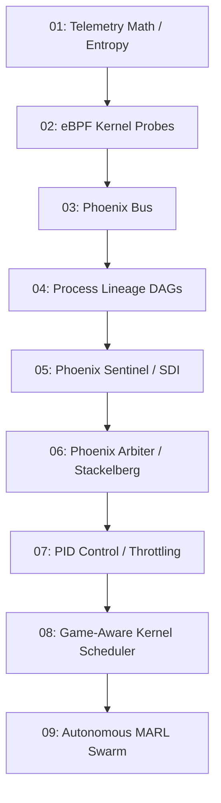

# Phoenix Master Dependency Graph

## Execution Path Constraint
No implementation stage starts before its research prerequisites and gate conditions are complete.

### Core Dependency DAG

## Violations Found and Resolved
1. **Premature AI (Resolved):** AI correlator (RFC-004) was listed without explicit dependency on Event Normalizer (RFC-007) and Phoenix Trace (RFC-006). Enforcing graph and normalized telemetry dependency.
2. **Missing State Estimation (Resolved):** Game theory (Stackelberg) must receive SDI (Physics) and Bayesian posterior probabilities before making mixed-strategy decisions.
3. **Kernel Work Before Validation (Resolved):** Phase E (In-Kernel Schedulers) strictly deferred until Phase D (Closed-loop PID) is experimentally validated via R031.
