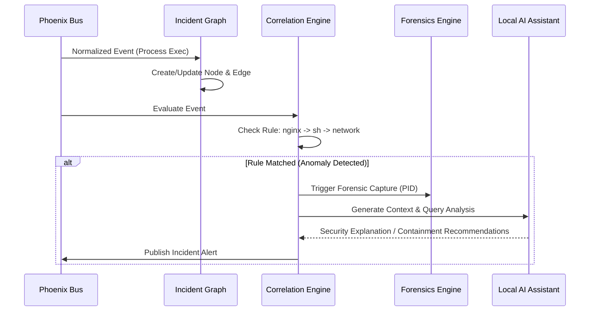

# RFC-004: AI Correlator & Incident Graph Engine

## Status
Approved

## 1. Purpose
This RFC specifies the AI Correlator and Incident Graph Engine for Phoenix. This module maintains an in-memory graph of process lineages, filesystem activities, and network connections. It uses deterministic rules to trigger alerts and connects to an offline local AI inference engine to provide security analysis.

## 2. Architecture & Data Structures

### 2.1 Incident Graph
We represent system behavior as a Directed Acyclic Graph (DAG) containing:
*   **Nodes:**
    *   `ProcessNode`: PID, command line, binary path, start time.
    *   `FileNode`: Absolute path, inode, type (file, socket, pipe).
    *   `NetworkNode`: Protocol, local IP, local port, remote IP, remote port.
*   **Edges:**
    *   `SPAWNED` (Process -> Process)
    *   `ACCESSED` (Process -> File)
    *   `ESTABLISHED` (Process -> Network)

### 2.2 Ingestion & Correlation Sequence


---

## 3. Interfaces

### 3.1 Graph Interface
```go
type Node interface {
    GetID() string
    GetType() string
}

type Edge struct {
    From Node
    To   Node
    Type string
}

type IncidentGraph interface {
    AddNode(n Node)
    AddEdge(fromID, toID string, edgeType string)
    GetAncestors(nodeID string, depth int) []Node
    Clear()
}
```

### 3.2 Correlation Rule Interface
```go
type Rule interface {
    Name() string
    Evaluate(event *Event, graph IncidentGraph) bool
}
```

### 3.3 Offline AI Assistant API
For the local SOC RAG helper, the correlator calls a local inference service (e.g. `llama.cpp` server) using this interface:
```go
type AIService interface {
    AnalyzeIncident(incidentContext string) (string, error)
}
```

---

## 4. Threat Assumptions
*   **Graph Manipulation:** An attacker attempts to hide their process parent-child relationship by daemonizing or orphan-grouping. *Mitigation:* The telemetry agent tracks real parent process IDs (PPID) using kernel-level process lineage, bypassing user-space spoofing.
*   **Adversarial Model Bypassing:** Malware hides its actions behind small, slow events to stay under correlation thresholds. *Mitigation:* Maintain sliding evaluation windows (e.g. 1 hour, 12 hours) inside the graph.

---

## 5. Performance Expectations & Budget
*   **Graph Insertion Overhead:** **< 0.5 milliseconds** per node/edge addition.
*   **Rule Evaluation Latency:** **< 2 milliseconds** per event.
*   **Graph Node Capacity:** Hard cap at **50,000 nodes** in-memory (evict nodes older than 4 hours).
*   **Local AI Latency:** **< 3 seconds** for response generation (using local quantized LLM like Llama-3-8B-Q4).

---

## 6. Failure Modes
1.  **AI Service Offline:** The local LLM server is unresponsive or crashed.
    *   *Action:* Log error, continue deterministic rule-based correlation, and mark the incident summary on the dashboard as "AI Analysis Unavailable".
2.  **In-Memory Graph Leak:** Graph growth leaks memory.
    *   *Action:* Evict old nodes aggressively using a Least-Recently-Used (LRU) policy.

---

## 7. Test Strategy
*   **Lineage Correlation Test:** Feed a simulated log sequence representing a web shell attack:
    1.  `exec` event: `nginx` (PID 100) -> `bash` (PID 101).
    2.  `filesystem` event: `bash` -> open `/etc/shadow`.
    3.  `network` event: `bash` -> connect `99.99.99.99:4444`.
    Verify that the correlation rule triggers an incident alert and correctly links all three nodes into a single incident graph tree.
*   **LRU Garbage Collection Test:** Add 100,000 nodes to the graph, verify that the active node count wraps at 50,000 and older nodes are freed.
