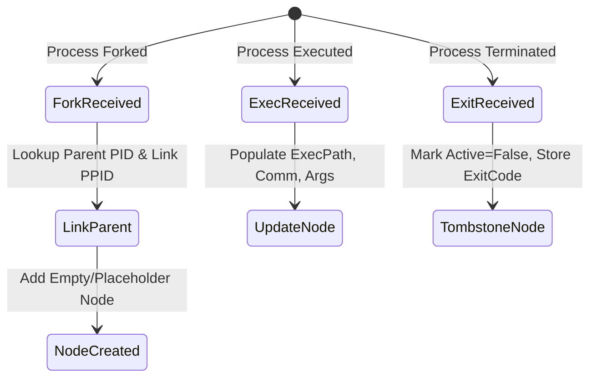

# RFC-006: Process Lineage Graph

## Status
Approved

## 1. Purpose
This RFC defines the design and data structures for building a real-time parent-child process lineage graph from telemetry events. Process lineage tracking is critical to identifying malicious behaviors such as execution of unauthorized child processes by system daemons (e.g., a web server spawning `sh`).

## 2. Phoenix Trace Data Structures

### 2.1 Process Node
Each process is represented as a node in the graph.

```go
type ProcessNode struct {
	PID        uint32        `json:"pid"`
	PPID       uint32        `json:"ppid"`
	OriginalPPID uint32      `json:"original_ppid"` // Preserved even after reparenting to PID 1
	Comm       string        `json:"comm"`
	ExePath    string        `json:"exe_path"`
	Args       []string      `json:"args"`
	UID        uint32        `json:"uid"`
	GID        uint32        `json:"gid"`
	StartTime  time.Time     `json:"start_time"`
	ExitTime   *time.Time    `json:"exit_time,omitempty"`
	ExitCode   int32         `json:"exit_code,omitempty"`
	IsActive   bool          `json:"is_active"`
	Children   []uint32      `json:"children"`       // PIDs of child processes
}
```

### 2.2 Phoenix Trace Store
The graph store maintains active processes in memory for fast lookup.

```go
type ProcessGraph struct {
	mu    sync.RWMutex
	Nodes map[uint32]*ProcessNode
}
```

---

## 3. Event Processing Logic

The Phoenix Trace builds its state incrementally by consuming normalized telemetry events.



### 3.1 Fork Event (`sched_process_fork`)
1. Create a new process node for the child PID.
2. Store the PPID (parent PID).
3. If the parent node exists in the graph, append the child PID to the parent's `Children` slice.
4. Set `OriginalPPID = PPID`.

### 3.2 Exec Event (`sched_process_exec`)
1. Lookup the process node matching the PID.
2. If it does not exist (e.g., startup race condition where the fork event was not captured), initialize a placeholder node.
3. Update `ExePath`, `Comm`, `Args`, `UID`, and `GID` using the exec event details.

### 3.3 Exit Event (`sched_process_exit`)
1. Lookup the process node matching the PID.
2. Set `IsActive = false`.
3. Set `ExitCode` and `ExitTime`.
4. Keep the node in memory for a configurable **Tombstone Duration** (default: 5 minutes) to allow forensics correlation, then purge.

---

## 4. Edge Cases

### 4.1 PID Recycling
Linux recycles PIDs after they reach `/proc/sys/kernel/pid_max`.
*   **Detection:** If a `fork` event is received for an existing active PID, or if the process creation timestamp is newer than the existing node, the old node must be archived/purged immediately, and a new node initialized.

### 4.2 Orphaning and Daemonization
When a parent process exits before its children, the kernel reparents the children to PID 1 (or the nearest subreaper).
*   **Mitigation:** The Phoenix Trace builder does **not** update the `PPID` or `OriginalPPID` to `1` upon parent termination. The `OriginalPPID` remains static to preserve the security context of the original parent-child relationships.

---

## 5. Performance Expectations & Budget
*   **Lookup Complexity:** $O(1)$ lookup for any node.
*   **Insertion Complexity:** $O(1)$ insertion.
*   **Memory Footprint:** Limit to 10,000 active nodes (approx. 5-10 MB in RAM). Old terminated nodes are swept out of memory after the tombstone period.

---

## 6. Threat Mitigations
*   **Evasion via Executable Renaming:** Tracked by storing both `comm` and `exe_path`.
*   **Evasion via Argument Spoofing:** Checked by analyzing execution arguments `args` at `execve` time, compared to subsequent changes in memory.
