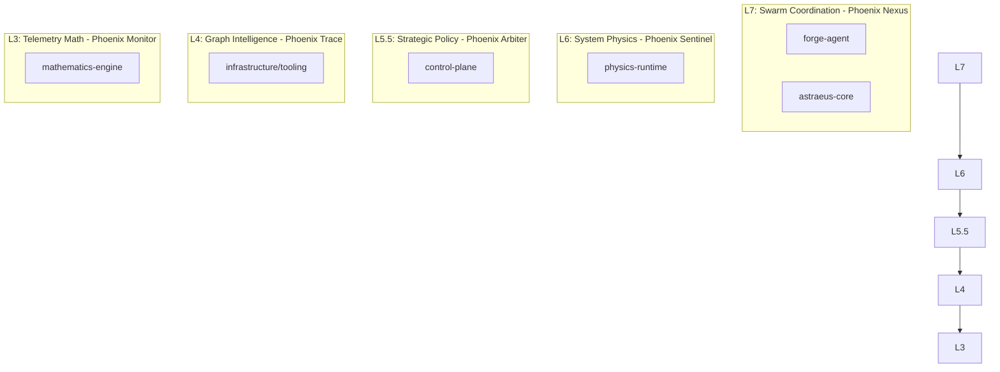

# PhoenixOS Custom Engineering Ecosystem Catalog

This catalog documents the custom repositories and modules located under `parts/engineering` that compose the **PhoenixOS 7-Layer Stack (Phoenix Matrix)**. Instead of using third-party reference code, PhoenixOS fully leverages these custom projects for cognition, physics simulations, policy governance, and mathematical substrates.

---

## 1. Stack Layer-to-Component Mapping

The custom projects are divided into system services, simulation tools, and agent runtimes that correspond to the Phoenix Matrix:

---

## 2. Detailed Component Catalogs

### ✦ Swarm Coordination (Phoenix Nexus - L7)
Coordinates the autonomous decision execution and agent system states.

*   **Forge Agent (`parts/engineering/workspace/active/core/forge-agent`)**
    *   *Purpose:* Runtime engine for autonomous security agents.
    *   *Core Files:*
        *   `core/orchestrator.py`: Multi-agent transaction coordination.
        *   `runtime/filesystem/policy.py`: Safe sandbox filesystem rules and overrides.
        *   `runtime/shell/executor.py`: Deterministic shell command executor.
    *   *Integration:* Serves as the actuation runtime when Phoenix Warden executes a security play.
*   **Astraeus Core (`parts/engineering/workspace/active/core/astraeus-core`)**
    *   *Purpose:* Planning and repair system context.
    *   *Core Files:*
        *   `orchestrator/dag.py`: Planning task dependency graphs.
        *   `repair/repair_planner.py`: Self-repair planning engine for recovering systems from anomalous or warning states.
        *   `shared_context/state.py`: Session context and state storage.

---

### ✦ System Physics (Phoenix Sentinel - L6)
Provides physical modeling of complex system stability states and energy levels.

*   **Physics Runtime (`parts/engineering/physics-runtime`)**
    *   *Purpose:* Substrate for modeling system thermodynamics and security disorder.
    *   *Key Files:*
        *   `particles/`: Models kinetic particle interactions and force fields.
        *   `electromagnetics/`: Field potentials and boundary solvers.
        *   `control/`: Control loop stability and feedback gains.
        *   `physics_thresholds.md`: Defines stability transitions (Stable, Warning, Critical, Collapse).
    *   *Integration:* Maps security event densities to physical kinetic energy levels to calculate thermodynamic SDI (Security Disorder Index).

---

### ✦ Strategic Policy (Phoenix Arbiter - L5.5)
Defines validation gates and game-theoretic policy constraints.

*   **Control Plane (`parts/engineering/workspace/active/core/control-plane`)**
    *   *Purpose:* Code governance, verification scanners, and agent sandboxing rules.
    *   *Key Files:*
        *   `governance/purity_scanner.py`: Static analysis scan to verify safety and determinism invariants.
        *   `governance/ecosystem_validator.py`: Cross-repo validation and integrity verifier.
        *   `agent-governance/verification/agent_purity_scanner.py`: Verifies agent instructions before execution.
    *   *Integration:* Arbitrates Warden policy updates by scanning proposed de-escalation actions for purity.

---

### ✦ Graph Intelligence (Phoenix Trace - L4)
Tracks causal lineage DAGs of system processes and network transactions.

*   **Infrastructure Tooling (`parts/engineering/workspace/active/core/infrastructure`)**
    *   *Purpose:* Software mapping, dependency graph engines, and transaction sync.
    *   *Key Files:*
        *   `tooling/dependency_graph.py`: Builds visual representations of package/system dependency graphs.
        *   `shared-libraries/transaction-processor/`: Validates transactional event chains.
    *   *Integration:* Structures live events from the kernel trace logs into process parent-child trees shown in the process-DAG visualizer.

---

### ✦ Telemetry Math (Phoenix Monitor - L3)
Mathematical substrate powering telemetry calculations, Kalman filters, and entropy scoring.

*   **Mathematics Engine (`parts/engineering/mathematics-engine`)**
    *   *Purpose:* Formal mathematical modeling libraries.
    *   *Key Files:*
        *   `math_registry.yaml`: Standardized registry mapping domains to execution hooks.
        *   `ODE/` & `PDE/`: Integrators and temporal state evolution.
        *   `info_theory/`: Information entropy and mutual information solvers.
        *   `optimization/`: Gradient descent and convex solvers.
    *   *Integration:* Provides analytical equations and solvers for calculating process entropy values.
