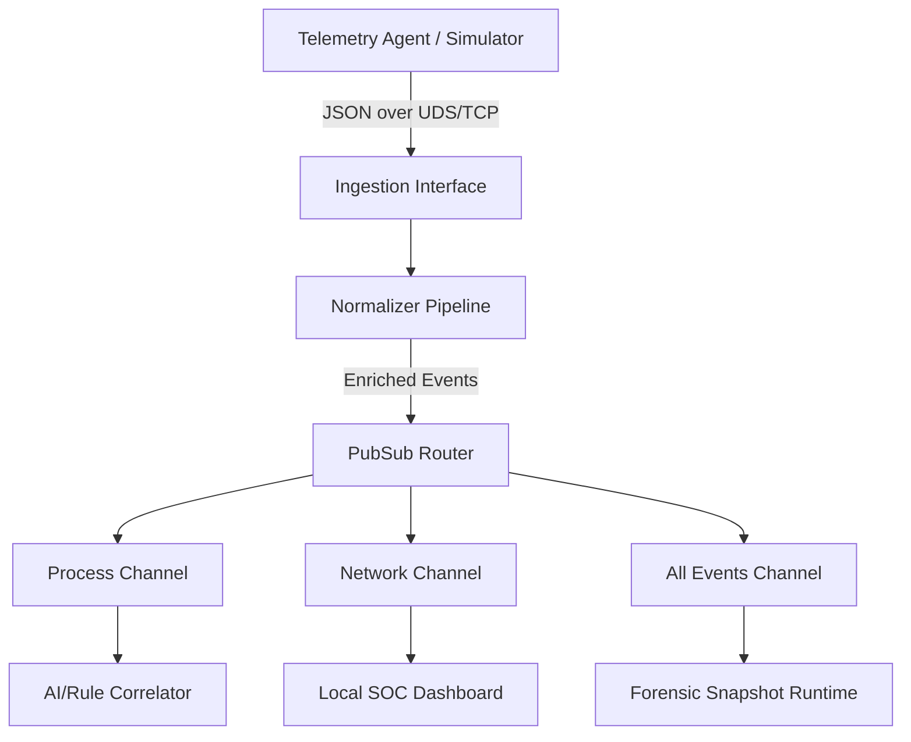

# RFC-002: Unified Event Bus

## Status
Approved

## 1. Purpose
This RFC defines the Unified Event Bus architecture for routing normalized telemetry events in Pheonix. It details the ingestion, normalization, filtering, and subscription routing systems, allowing the local SOC dashboard, detection engine, and forensics recorder to receive real-time, order-preserved logs.

## 2. Architecture & Data Flow


## 3. Interfaces

### 3.1 Normalizer Interface
Responsible for enriching events (e.g., matching UID to usernames, calculating hash values, checking container metadata).
```go
type Normalizer interface {
    Normalize(raw []byte) (*Event, error)
    Enrich(event *Event) error
}
```

### 3.2 Broker Interface
The core publish-subscribe broker interface.
```go
type EventBroker interface {
    Publish(event *Event)
    Subscribe(category string) <-chan *Event
    Unsubscribe(category string, ch <-chan *Event)
}
```

### 3.3 Consumer APIs
- **Internal Channels:** Go channels (in-memory) for high-speed local routing to the Correlator and Forensic engines.
- **IPC Interface:** Unix Domain Socket (`/var/run/sentinel_events.sock`) for external tool subscriptions.
- **Web API Interface:** Server-Sent Events (SSE) `/api/events` or WebSockets for the SOC dashboard UI.

---

## 4. Threat Assumptions
*   **Unauthorized Subscription:** A low-privileged process tries to read kernel telemetry. *Mitigation:* Bind Unix Domain Sockets with strict permissions (`0660`, group `sentinel-admin`) and enforce Unix socket credentials checks (PEERCRED).
*   **Broker Exhaustion (Denial of Service):** An attacker floods the system with processes to crash the broker. *Mitigation:* Set explicit queue capacities (e.g., 10,000 elements per subscriber). When a subscriber's channel is full, drop oldest packets to prevent blocking other consumers.

---

## 5. Performance Expectations & Budget
*   **Rerouting Latency:** End-to-end routing latency (broker ingestion to subscriber channel delivery) must be **< 2 milliseconds** under load.
*   **Memory Budget:** The broker must not consume more than **80 MB RAM** at peak capacity.
*   **Queue Capacity:** Subscriber buffers are set to **10,000 events** before oldest-eviction triggers.

---

## 6. Failure Modes
1.  **Slow Consumer Bottleneck:** A subscriber (e.g., SOC Dashboard) stops reading from its channel.
    *   *Action:* The broker checks if the channel buffer is full. If so, it drops the oldest events, increments a `dropped_events` telemetry counter, and continues serving active subscribers.
2.  **Socket Disconnection:** The UDS listener drops due to system interruption.
    *   *Action:* The listener automatically attempts recovery; the telemetry agent queues events locally in an ephemeral ring buffer.

---

## 7. Test Strategy
*   **PubSub Race Condition Tests:** Run multi-threaded publishers and subscribers to detect memory access races (verified using `go test -race`).
*   **Throughput Benchmarks:** Measure execution time for `Publish` and `Subscribe` at 100,000 events/sec.
