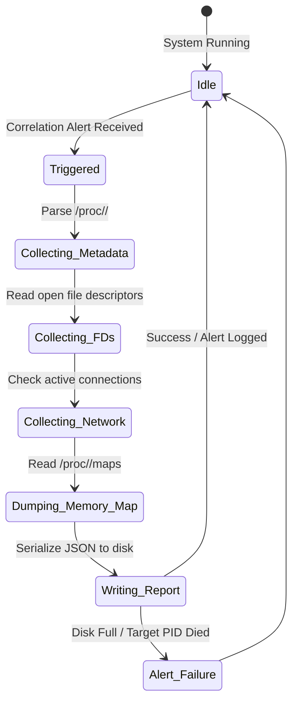

# RFC-003: Forensic Snapshot Runtime

## Status
Approved

## 1. Purpose
This RFC specifies the design of the Forensic Snapshot Runtime in SentinelOS. When a security threat or anomalous event is detected, the runtime is triggered to gather system state data (process metadata, active connections, open file descriptors, and memory mappings) from the target environment.

## 2. Forensic State Machine


## 3. Data Acquisition Targets (procfs Analysis)
For a given target process PID, the runtime captures:
1.  **Process Context:** Reading `/proc/<pid>/cmdline`, `/proc/<pid>/environ`, `/proc/<pid>/status`.
2.  **Open Handles (File Descriptors):** Scanning directory `/proc/<pid>/fd/` and resolving symlinks.
3.  **Active Connections:** Matching local socket file descriptors to open tcp/udp endpoints.
4.  **Process Memory Map:** Reading `/proc/<pid>/maps` and recording readable/executable (`r-xp`) or writable/executable (`rwxp`) memory segments.

---

## 4. Interfaces

### 4.1 Forensic API
```go
type ForensicEngine interface {
    CaptureSnapshot(incidentID string, targetPID uint32) (*ForensicReport, error)
    SaveReport(report *ForensicReport) (string, error)
}
```

### 4.2 Output Schema (`08_forensics/reports/`)
Saves a JSON report matching this layout:
```json
{
  "report_id": "string (UUIDv4)",
  "incident_id": "string (UUIDv4)",
  "timestamp": "string (RFC3339)",
  "pid": "uint32",
  "comm": "string",
  "exe": "string",
  "environ": {
    "PATH": "/usr/bin",
    "SECRET_MASKED": "********"
  },
  "open_fds": [
    { "fd": 3, "path": "/etc/shadow" }
  ],
  "connections": [
    { "local": "127.0.0.1:4821", "remote": "8.8.8.8:53", "proto": "UDP" }
  ],
  "memory_regions": [
    { "address": "00400000-00452000", "perms": "r-xp", "offset": 0, "dev": "08:01", "inode": 1234, "path": "/usr/bin/malicious" }
  ]
}
```

---

## 5. Threat Assumptions
*   **PID Reuse Race Condition:** The target process dies and a legitimate new process inherits the PID before capture begins. *Mitigation:* Verify process name and creation time (`stat /proc/<pid>/`) before starting capture.
*   **Secrets Exposure:** Capturing environment variables exposes database keys or user passwords. *Mitigation:* Implement regex filtering to mask values for keys containing `PASS`, `SECRET`, `TOKEN`, `KEY`, `JWT`, or `AUTH`.
*   **Disk Exhaustion:** An attacker triggers thousands of alerts to fill the hard drive with forensic dumps. *Mitigation:* Implement storage caps on `08_forensics/reports/` (max 500 MB total space; delete oldest logs when exceeded).

---

## 6. Performance Expectations & Budget
*   **Execution Time:** Total capture and JSON serialization must finish in **< 100 milliseconds** from trigger.
*   **Memory Budget:** Maximum temporary allocation is **15 MB RAM** during collection.
*   **Report File Size:** Target process report size must not exceed **2 MB** (excluding binary dumps).

---

## 7. Failure Modes
1.  **PID Not Found (Process Exited):** The process terminated before acquisition started.
    *   *Action:* Record exit status, capture system-wide network connections, and dump general system logs instead.
2.  **Permission Denied:** The forensics runner lacks `CAP_SYS_PTRACE` or root access.
    *   *Action:* Fail gracefully, log capabilities configuration error, and notify the local SOC dashboard.

---

## 8. Test Strategy
*   **Simulation Capture:** Spawn a mock test process that opens specific file descriptors and connects to a test socket, trigger the forensics engine, and assert that all files and sockets are correctly listed in the generated JSON report.
*   **Secret Masking Tests:** Pass environment variables like `DB_PASSWORD=secret123` to the mock process and verify the output contains `"DB_PASSWORD": "********"`.
