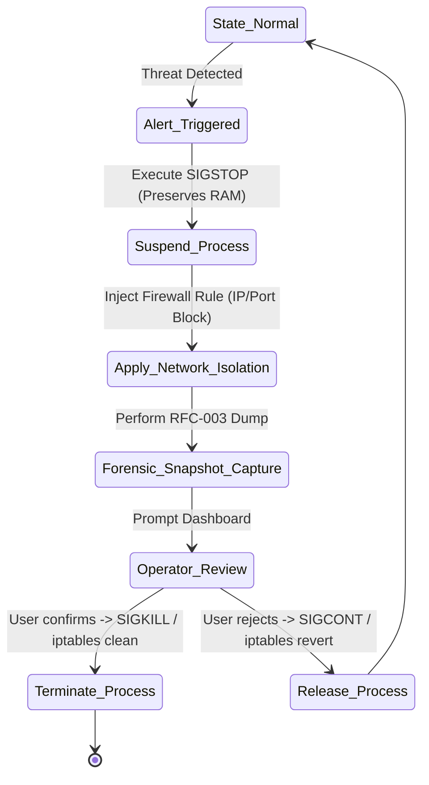

# RFC-005: Containment Engine Primitives

## Status
Approved

## 1. Purpose
This RFC specifies the Containment Engine Primitives for SentinelOS. These primitives allow the system to quickly isolate compromised processes and network connections. The engine provides low-latency isolation techniques to minimize threat propagation while preserving forensic data for triage.

## 2. Containment Sequence Flow


---

## 3. Primitives & Interfaces

### 3.1 Containment Engine Interface
```go
type ContainmentEngine interface {
    SuspendProcess(pid uint32) error
    ResumeProcess(pid uint32) error
    TerminateProcess(pid uint32) error
    BlockIP(ip string, port uint16, direction string) error
    UnblockIP(ip string, port uint16, direction string) error
}
```

### 3.2 Primitives Implementation
1.  **Process Suspension (`SIGSTOP`):** Freezes the process execution thread without destroying its address space, allowing memory dump acquisition.
2.  **Process Termination (`SIGKILL`):** Safely terminates the process after forensic extraction has finished.
3.  **Network Isolation:** Inserts temporary `iptables` / `nftables` DROP rules.
    *   *Command pattern:* `iptables -A OUTPUT -p tcp -d <IP> --dport <Port> -j DROP`
    *   *Mock pattern (macOS):* Log command execution, or run `pfctl` rules on macOS when running locally.

---

## 4. Security Policies & Whitelists
To prevent self-denial of service, the Containment Engine enforces **immutable whitelists**:
*   **Daemon Whitelist:** Under no circumstances will the agent suspend or terminate PID `1` (systemd/launchd), PID `0` (idle), or the SentinelOS agent itself.
*   **Network Whitelist:** Loopback interface `127.0.0.1`, DNS resolution ports, and active SSH socket ports (Port 22/tcp) are excluded from blocking.

---

## 5. Performance Expectations & Budget
*   **Process Suspension Latency:** Must occur in **< 1 millisecond** from command execution.
*   **Network Rule Insertion:** Must apply within **< 5 milliseconds**.
*   **Recovery Latency:** Unblocking or resuming processes must take **< 5 milliseconds**.

---

## 6. Failure Modes
1.  **Zombie Process:** The target process is in a zombie state and cannot be killed.
    *   *Action:* Clean up its parent process relationship, log the zombie state, and isolate its network access.
2.  **Permission Escalation Failure:** The runner does not have root capabilities (`CAP_NET_ADMIN`, `CAP_KILL`).
    *   *Action:* Fail immediately, alert the dashboard, and log a critical systems alert.

---

## 7. Test Strategy
*   **Suspension Test:** Spawn a test process that logs to a file. Trigger `SuspendProcess`, verify the logs stop, check state `T` in `ps`, then trigger `ResumeProcess`, and verify logs resume.
*   **Whitelist Verification:** Attempt to block IP `127.0.0.1` and verify the Containment Engine returns an explicit `ErrWhitelisted` error.
