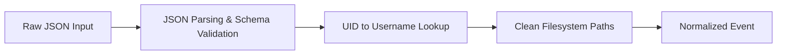

# RFC-007: Event Normalizer

## Status
Approved

## 1. Purpose
This RFC specifies the Event Normalizer component of the SentinelOS Unified Event Bus. The Event Normalizer is responsible for validating raw telemetry events against the JSON schema (`02_docs/schemas/telemetry_events.json`), parsing them into strongly-typed Go structures, and enriching them with system metadata (such as usernames and normalized file paths).

## 2. Ingestion & Normalizer Interface

The Event Normalizer implements the following API:

```go
package normalizer

import (
	"time"
)

// Event represents the normalized telemetry event routed through the event bus
type Event struct {
	Timestamp   time.Time              `json:"timestamp"`
	EventID     string                 `json:"event_id"`
	Category    string                 `json:"category"`
	EventType   string                 `json:"event_type"`
	HostID      string                 `json:"host_id"`
	PID         uint32                 `json:"pid"`
	PPID        uint32                 `json:"ppid"`
	UID         uint32                 `json:"uid"`
	GID         uint32                 `json:"gid"`
	Username    string                 `json:"username,omitempty"` // Enriched
	Comm        string                 `json:"comm"`
	ExePath     string                 `json:"exe_path"`
	ContainerID string                 `json:"container_id,omitempty"`
	Payload     map[string]interface{} `json:"payload"`
}

type Normalizer interface {
	// Normalize parses and validates raw JSON event data
	Normalize(raw []byte) (*Event, error)

	// Enrich adds metadata (e.g. usernames, path normalization) to the parsed event
	Enrich(event *Event) error
}
```

---

## 3. Normalization & Enrichment Logic



### 3.1 Schema Validation
*   The raw JSON string is checked against `telemetry_events.json` to ensure compliance.
*   Invalid events are rejected immediately to prevent dirty data or injection attacks in downstream components.

### 3.2 Metadata Enrichment
1.  **UID-to-Username Mapping:**
    *   **Simulation Mode:** The normalizer uses a static mock map (e.g. `0` -> `root`, `501` -> `user`) or invokes `user.LookupId` on the macOS host.
    *   **Production Mode (Linux):** Reads `/etc/passwd` directly, caching results in memory with a short TTL (e.g., 5 minutes) to avoid frequent filesystem reads.
2.  **Filesystem Path Normalization:**
    *   For filesystem category events, the `file_path` field in the payload is normalized using Go's `path.Clean()` to resolve directory traversals (`../`) or duplicate slashes.

---

## 4. Failure Modes & Safety Gates
*   **Malformed JSON:** The normalizer returns a parsing error. Malformed JSON events are discarded, and an error metric is logged.
*   **Missing Required Fields:** Events that lack critical headers (like `event_id`, `pid`, `exe_path`) fail validation and are rejected.
*   **Enrichment Slowdowns:** UID lookup uses an in-memory cache to prevent blocking the event ingestion thread.

---

## 5. Performance Targets & Budget
*   **Validation Overhead:** Must take **< 10 microseconds** per event payload.
*   **Zero-Allocation Ingestion:** Use JSON streaming/decoders where appropriate to minimize garbage collection cycles.
