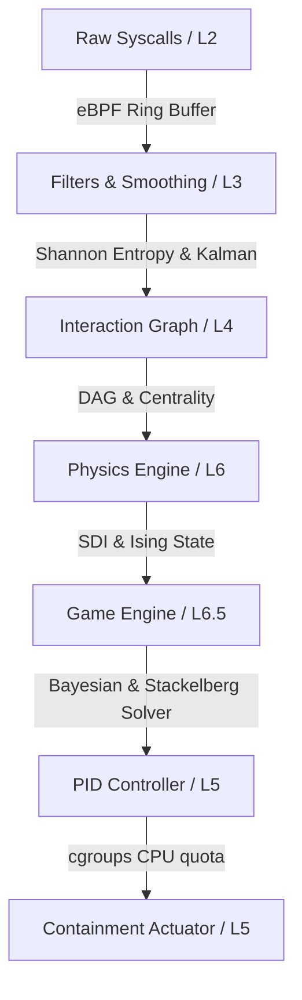

# RFC-009: Mathematical-Physical Architecture & Game Engine Integration

## Status
Proposed

## 1. Purpose
This RFC specifies the unified mathematical-physical architecture of SentinelOS. It defines the L1–L7 structural system stack and outlines the data processing flow pipeline where the **Game Engine** operates as a strategic decision-making layer, consuming telemetry metrics (L3), graph states (L4), and physical disorder indexes (L6) to compute optimal control and containment inputs (L5).

---

## 2. SentinelOS System Stack (L1–L7)
The static architecture of the OS is structured into seven logical layers:

```text
+-------------------------------------------------------------------+
| L7: Autonomous Security Layer (Swarm Consensus, Swarm Games)     |
+-------------------------------------------------------------------+
| L6: Game Engine & Incident Physics Engine (SDI, Stackelberg, Nash)|
+-------------------------------------------------------------------+
| L5: Control & Dynamics (PID Feedback, cgroups Starvation Actuator)|
+-------------------------------------------------------------------+
| L4: Graph Intelligence (Interaction DAGs, Centrality, Louvain)   |
+-------------------------------------------------------------------+
| L3: Telemetry Mathematics (Shannon Entropy, Kalman Filters, TDA)  |
+-------------------------------------------------------------------+
| L2: Kernel Telemetry Runtime (eBPF probes, LSM Hooks, Ring Buffer)|
+-------------------------------------------------------------------+
| L1: Hardware / Linux / Hypervisor Platform                        |
+-------------------------------------------------------------------+
```

---

## 3. Dynamic Event Flow Pipeline
The event processing pipeline maps how telemetry transforms from raw syscall events into security containment actions:



### 3.1 Pipeline Data Transformations
1.  **L2 $\to$ L3:** Raw events are sampled and smoothed. Write buffers are analyzed for Shannon entropy ($H(X)$); periodic anomalies are filtered via Wavelets or Kalman smoothers.
2.  **L3 $\to$ L4:** Labeled telemetry events are ingested to build a directed, causal lineage graph $G(t) = (V(t), E(t))$. Louvain clustering segregates normal operational zones.
3.  **L4 $\to$ L6:** The graph structures feed the physics engine, which computes the global Security Disorder Index (SDI) and maps node interactions to Ising spin configurations $\sigma_i$.
4.  **L6 $\to$ L6.5 (Game Engine):** Physical state deviations and prior beliefs initialize the Stackelberg or Bayesian security game model.
5.  **L6.5 $\to$ L5:** The Game Engine solves the game (Nash equilibrium or follower response), outputting the target containment intensity $u(t)$.
6.  **L5 $\to$ Actuator:** The PID controller stabilizes the execution path, translating $u(t)$ into cgroups throttling parameters (`cpu.cfs_quota_us`).

---

## 4. Interfaces & Data Schemas

### 4.1 Telemetry State & Payoff Types
```go
package game

import "time"

// GameState represents the resolved threat landscape of the host
type GameState struct {
	Timestamp     time.Time
	ThreatTemp    float64   // Global physical threat temperature (theta_T)
	SecurityDisorder float64 // Current SDI (Security Disorder Index)
	PriorBeliefs  map[string]float64 // Bayesian attacker type probabilities
	SuspiciousNodes []string // High centrality/anomalous vertex IDs
}

// PayoffMatrix defines utilities for Attacker vs Defender actions
type PayoffMatrix struct {
	DefenderActions []string
	AttackerActions []string
	Utilities       [][]float64 // Dimensions: [Attacker][Defender]
}
```

### 4.2 Game Engine Interface
```go
package game

// GameEngine computes strategic containment strategies based on system state
type GameEngine interface {
	// UpdateBeliefs processes new telemetry evidence to update prior attacker types
	UpdateBeliefs(state *GameState, evidence string) error

	// CalculateNashEquilibrium solves the normal-form game matrix
	CalculateNashEquilibrium(matrix PayoffMatrix) (defenderStrategy []float64, err error)

	// SolveStackelbergPolicy calculates the mixed strategy defender policy
	SolveStackelbergPolicy(state *GameState) (targetContainmentLevel int, targetPIDs []uint32, err error)
}
```

---

## 5. Security Models & Formulations

### 5.1 Bayesian Belief Updates
The Game Engine manages uncertainty using recursive Bayesian updating. The probability of the active process group being ransomware ($\theta_{ran}$) vs benign ($\theta_{ben}$) given high write-entropy evidence ($e_{ent}$) is:
$$P(\theta_{ran} \mid e_{ent}) = \frac{P(e_{ent} \mid \theta_{ran}) P(\theta_{ran})}{P(e_{ent} \mid \theta_{ran}) P(\theta_{ran}) + P(e_{ent} \mid \theta_{ben}) P(\theta_{ben})}$$

### 5.2 Stackelberg Commitment
SentinelOS commits to monitoring densities and throttle rates. Let $U_D(c, a)$ be the Defender's utility when deploying containment action $c$ against attack action $a$. The Game Engine maximizes utility:
$$\max_{\mathbf{p} \in \Delta(\mathcal{C})} \sum_{c \in \mathcal{C}} p_c U_D(c, a^*(p))$$
Where $a^*(p)$ is the attacker's best response to the defender's mixed strategy $\mathbf{p}$.

---

## 6. Performance Expectations & Budget
*   **Bayesian classification latency:** $\le 0.5$ ms per telemetry window.
*   **Stackelberg strategy selection:** $\le 1.0$ ms.
*   **System Overhead:** The Game Engine must consume $\le 0.5\%$ of total CPU and $\le 30$ MB RAM under peak event processing.

---

## 7. Failure Modes & Mitigations
1.  **State Mismatch:** The game model thinks the threat is benign due to adversarial evasion (low write rates).
    *   *Mitigation:* The physics engine acts as a safety fallback; if global SDI exceeds $2.0$, it bypasses the game engine and forces an immediate L4 network and L3 process suspension.
2.  **Solver Divergence:** The linear programming solver fails to converge on a Stackelberg policy.
    *   *Mitigation:* Revert immediately to the minimax pure strategy lookup matrix (pre-calculated).

---

## 8. Test & Validation Strategy
*   **Bayesian Updater Test:** Inject telemetry sequences of compiling code (spiky writes) and ransomware (continuous high-entropy writes). Verify that the posterior probability for ransomware remains $\le 0.05$ for compiler and climbs $\ge 0.95$ for ransomware.
*   **Solver Performance Test:** Run the Stackelberg solver continuously for $10,000$ iterations and verify that computation latency never exceeds the $1.0$ ms budget.
