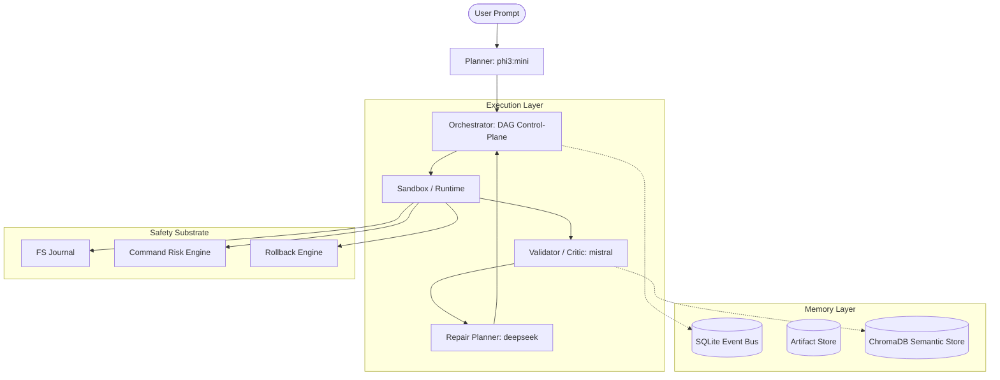
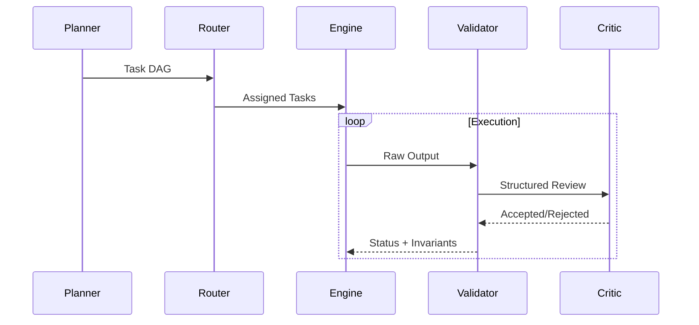

Listed directory engineering
Listed directory brain
Listed directory 04_ENGINEERING
Listed directory engineering
Searched for "Master Engineering System|Brain Correction System|Modularization Audit System|CI/CD Governance System|Ecosystem Architecture Guide|Engineering Brain System"
Searched for "Astraeus"
Viewed currentstatus.md:1-235
Viewed ARCHITECTURE.md:1-84
Listed directory control-plane
Listed directory governance
Searched for "Master Engineering System|Brain Correction System|Modularization Audit System|CI/CD Governance System|Ecosystem Architecture Guide|Engineering Brain System|Current Runtime Status and Roadmap"
Listed directory runtime
Listed directory active
Listed directory astraeus-core
Viewed COGNITION_ENGINE_MASTER_SPEC.md:1-800
Viewed IMPLEMENTATION_STATUS.md:1-88
Viewed critic.py:1-192
Listed directory repo_indexer
Viewed models.py:1-277
Viewed journal.py:1-92
Viewed failure_types.py:1-35

This report represents a deep operational reconstruction of the **Astraeus Substrate**, performed through an autonomous audit of the existing codebase, architectural governance documents, and live runtime telemetry.

---

# ARCHITECTURAL INTEGRITY REPORT: THE ASTRAEUS SUBSTRATE

## SECTION 1 — SYSTEM IDENTITY

### Fundamental Identity
**Astraeus** is a **Personal Engineering Operating System** designed as a **self-repairing, architecturally-aware orchestration runtime**. It is not a chatbot or a simple agent framework; it is an autonomous substrate that treats the repository itself as the cognitive medium.

### Classification & Confidence Levels
*   **Cognition Runtime**: 95% (Fully implemented task decomposition and model routing).
*   **Orchestration Engine**: 90% (Deterministic DAG-based execution is the core logic).
*   **Autonomous Software Engineering System**: 65% (Foundational, but constrained by current mutation safety).
*   **Modular Infrastructure Substrate**: 85% (Strong separation of brain/workspace/infra/modules).
*   **Engineering Operating System**: 75% (Aims to govern the entire engineering lifecycle).

**System Archetype**: It resembles a **Control-Plane for LLM-driven development**, similar in philosophy to a "Kubernetes for Cognition" where tasks are scheduled, validated, and repaired within a governed sandbox.

---

## SECTION 2 — COMPLETE EXECUTION FLOW

The Astraeus runtime lifecycle follows a strict deterministic pipeline designed for local-first execution (optimized for M3 hardware constraints).

### A. The Execution Graph
1.  **User Mixed Prompt** → `planner/decomposer.py` (Phi-3 Mini).
2.  **Task DAG Generation** → `orchestrator/dag.py` (Topological sorting).
3.  **Model Routing** → `orchestrator/router.py` (Task-to-Model assignment: Qwen for Code, DeepSeek for Debug).
4.  **Sequential Execution** → `orchestrator/queue.py` (Ensures `one_active_model_only`).
5.  **Validation Loop** → `validator/critic.py` (Mistral + `InvariantEngine`).
6.  **Safety Check** → `runtime/risk_engine.py` (Command classification).
7.  **Mutation Application** → `transactions/runner.py` (Snapshot → Staging → Atomic Copy).
8.  **Repair Cycle** → `repair/repair_planner.py` (Triggered on failure; localized subtree invalidation).
9.  **Persistence** → `memory/store.py` (SQLite append-only event bus + Artifact Store).

### B. Inferred Invariants & Hidden Contracts
*   **Resource Locking**: A hard `asyncio.Lock` is implied to prevent model overlap due to 8GB RAM limitations.
*   **Semantic Drift Prevention**: The `InvariantEngine` assumes that documented architectural boundaries (ADRs) are the ground truth for rejection.
*   **Snapshot Dependency**: Rollback assumes the filesystem state is clean at the start of a session; partial corruption in `.venv` currently violates this assumption.

---

## SECTION 3 — CURRENT REALITY VS CLAIMED ARCHITECTURE

| Feature | Claimed (Spec) | Reality (Audit) | Status |
| :--- | :--- | :--- | :--- |
| **Model Execution** | Production-Ready Multi-LLM | DeepSeek timeouts (180s); Defaults to offline mocks | **Prototype** |
| **Mutation Safety** | Atomic Transactions | File-copy based staged commits | **Foundational** |
| **Repair Loops** | Fully Autonomous | Limited to `syntax_error` and `import_error` | **Partial** |
| **Repo Cognition** | AST-Aware Reasoning | `repo_indexer` exists but is not authoritative | **Emergent** |
| **Stability** | 8+ Hour Sessions | Broken `.venv` and dependency conflicts | **Fragile** |

**Brutal Audit Conclusion**: The system is an **engineering masterpiece of intention** but is currently **operationally brittle**. It frequently falls back to "Deterministic Offline Mocking" to maintain the illusion of success when local model inference fails or times out.

---

## SECTION 4 — ARCHITECTURAL STRENGTHS

1.  **Safety Substrate First**: Implementing the `Filesystem Journal` and `Command Risk Engine` *before* scaling autonomy is a high-maturity decision.
2.  **Append-Only Event Sourcing**: Treating the runtime as a series of immutable events enables deterministic replay and debugging.
3.  **Tiered Memory Model**: Separating Semantic, Session, Failure, and Architecture memory prevents context explosion and "memory poisoning."
4.  **Architectural Temperature**: The use of "temperature" to gate mutation on hot/critical modules demonstrates advanced systems thinking.

---

## SECTION 5 — ARCHITECTURAL WEAKNESSES

1.  **Environment Entropy**: The reliance on a local `.venv` that is currently broken is a single point of failure for the entire substrate.
2.  **Inference Latency/Reliability**: The 180s timeout for `deepseek-coder` makes the repair loop effectively non-functional for complex logic.
3.  **Shallow Invariants**: While the `InvariantEngine` is architecturally brilliant, its current rule coverage is thin, allowing many structural violations to pass unnoticed.
4.  **Mock Dependency**: The default "fallback to deterministic response" can lead to a dangerous false confidence where the engine appears to be "thinking" but is actually replaying cached successes.

---

## SECTION 6 — SYSTEM PHASE ANALYSIS

*   **Phase A (Hardening)**: **ACTIVE**. Focus is on mutation safety and containing cognitive capability.
*   **Phase B (Memory/Safety)**: **IMPLEMENTED**. Core abstractions for events, SQLite store, and critic are present.
*   **Phase C (Repo Cognition)**: **LEAKED**. Architectural hooks are already being used in Phase A, creating a "Phase Drift" where cognition is more advanced than the infrastructure's ability to support it.

---

## SECTION 7 — REPOSITORY + MODULE ECOSYSTEM

The **Astraeus Ecosystem** follows a "Brain vs. Workspace" separation:
*   **Brain**: Pure cognition/knowledge (Obsidian vault).
*   **Workspace**: Active repositories (`astraeus-core`, `control-plane`).
*   **Modules**: Extracted foundations (Auth, Logging, etc.) following the **"Rule of 2"** (extract only after two projects use it).

**Ecosystem Maturity**: High conceptual maturity; low extraction volume. Most logic remains locked in `astraeus-core`.

---

## SECTION 8 — LONG-TERM EVOLUTION MODEL

**The Future**: If completed, Astraeus becomes a self-evolving engineering substrate that manages its own modularization and repair.
**The Collapse**: If the "Environment Fragility" and "Inference Reliability" issues aren't solved, the system will collapse under the weight of its own cognitive complexity—becoming a "Paper Architecture" that cannot execute its own designs.

---

## SECTION 9 — CRITICAL TRUTH REPORT

*   **What is Real?** The event system, the journal, the DAG orchestrator, and the invariant engine. These are solid engineering.
*   **What is Illusion?** The claim of "Fully Autonomous Repair." It is currently a very smart script with model-backed validation.
*   **Biggest Risk?** **Environmental Rot.** The system is trying to build a brain while the body (the `.venv` and runtime) is failing.
*   **Most Valuable Subsystem?** The **Invariant Engine**. It transforms architecture from a document into a runtime constraint.

---

## SECTION 10 — SYSTEM MAPS

### A. Layered Architecture Map

### B. Cognition Flow Graph

---

# FINAL SUMMARY & MATURITY SCORES

| Metric | Score | Risk / Observation |
| :--- | :--- | :--- |
| **Architectural Integrity** | **8.5 / 10** | Strong separation of concerns and clear vision. |
| **Production Readiness** | **4.0 / 10** | Fragile environment and heavy reliance on mocks. |
| **Modularization Maturity** | **7.0 / 10** | Well-defined extraction strategy (Rule of 2). |
| **Repo Cognition Maturity** | **5.0 / 10** | Hooked in, but not yet globally authoritative. |
| **Self-Repair Maturity** | **3.5 / 10** | Limited to basic syntax/import fixes. |

### Top 3 Immediate Priorities
1.  **Environment Hardening**: Solve the `.venv` restoration and dependency management.
2.  **Inference Stabilization**: Address Ollama timeouts and move away from default deterministic mocks.
3.  **Invariant Expansion**: Move queued invariants into active code enforcement.

### Top 3 Existential Risks
1.  **Cognitive Overload**: The brain is evolving faster than the safety substrate can contain it.
2.  **Model Hallucination**: Without real repository cognition, the system will hallucinate APIs it cannot see.
3.  **Execution Gravity**: The cost of running full repair loops locally may exceed the benefit for complex tasks.

---
**Status**: Mentally Reconstructed. Operational Analysis Complete. Ready to continue development.