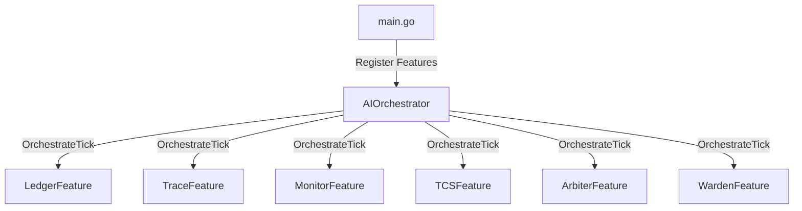

# RFC-001: AI-First Operating System Orchestrator

**Author:** Antigravity Agent
**Date:** 2026-05-23
**Status:** Approved

## Abstract
This RFC details the architectural changes required to shift PhoenixOS from a hard-coded sequential step loop to a modular, AI-orchestrated runtime. Subsystems are wrapped as `Feature` modules, giving the AI agent ultimate oversight of the loop lifecycle.

## Architecture

## Immutable Guardrails
1. **Ledger Integration**: All state modifications must be signed and added to the cryptographic Merkle Ledger.
2. **Deterministic Checkpoints**: Logical clock ticks trigger reproducible state snapshots.
