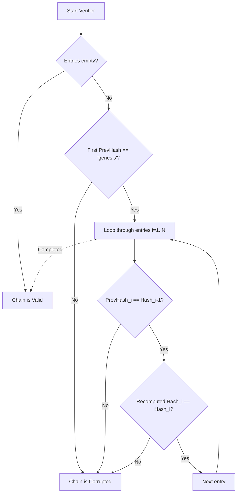

# PhoenixOS: Evidence Specification (L11)

The Evidence Layer provides the mathematical foundation of non-repudiation in PhoenixOS. It guarantees that telemetry events, strategic decisions, and Warden state transitions are immutably chained and protected against backdating or unauthorized modification.

---

## 1. Evidence Data Structures

The evidence chain is represented as a cryptographic hash-chained log stored in the `truth.TruthLedger`.

### EvidenceWrapper Struct
Each record in the ledger is wrapped in an `EvidenceWrapper`:

```go
type EvidenceWrapper struct {
    ID        string      // Unique event UUID
    Sequence  uint64      // Monotonic sequence number
    Timestamp time.Time   // Logical event timestamp
    Payload   interface{} // Raw event byte payload
    PrevHash  string      // SHA-256 hex string of the previous wrapper
    Hash      string      // SHA-256 hex string of the current wrapper
}
```

### TruthLedger Struct
The append-only evidence store manages the chain and heads:

```go
type TruthLedger struct {
    Entries       []EvidenceWrapper
    HeadHash      string
    CurrentSeqID  uint64
    ReplayCursor  uint64
    seenSequences map[uint64]bool // Prevents duplicate sequences (replay attacks)
    seenHashes    map[string]bool // Prevents duplicate block hashes
}
```

---

## 2. Cryptographic Hash Chain Math

The hash of each block is a deterministic SHA-256 checksum calculated from its fields:

$$Hash_i = \text{SHA-256}\left(Seq_i \mathbin{\Vert} Ts_i \mathbin{\Vert} Hash_{i-1} \mathbin{\Vert} Payload_i\right)$$

In Go, this is canonicalized as a formatted string before hashing:

```go
func CalculateHash(prevHash string, payload []byte, seqID uint64, ts int64) string {
    h := sha256.New()
    h.Write([]byte(fmt.Sprintf("%d-%d-%s-%v", seqID, ts, prevHash, payload)))
    return hex.EncodeToString(h.Sum(nil))
}
```

---

## 3. Verification Algorithms

The Truth Ledger implements two validation algorithms to check chain integrity:



### 1. Full Audit Verification (`Verify`)
Validates the entire chain from genesis to head:
1. **Genesis Check:** Asserts that `Entries[0].PrevHash == "genesis"`.
2. **Continuity Check:** Asserts that `Entries[i].PrevHash == Entries[i-1].Hash` for all $i \ge 1$.
3. **Integrity Check:** Recalculates and verifies $Hash_i$ for all entries. Any mismatch flags corruption and halts the runtime.

### 2. Segmented Verification (`VerifyRange`)
Validates a specific range of sequence numbers $[start, end]$, checking link and hash integrity against the hash of element $start-1$ as a checkpoint baseline.
