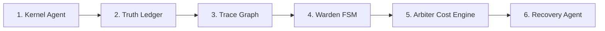

# Operations: Startup Sequence

This document defines the mandatory startup order for running the PhoenixOS runtime services.

## Startup Dependency Flow
Services must be initialized in sequence to ensure that the IPC channels, telemetry buffers, and state registries are correctly linked.



## 1. Start Services

### Terminal 1: Kernel Agent (Root Permissions)
```bash
sudo ./bin/kernel_agent
```

### Terminal 2: Truth Ledger
```bash
./bin/truth_service
```

### Terminal 3: Trace Engine
```bash
./bin/trace_engine
```

### Terminal 4: Warden FSM
```bash
./bin/warden
```

### Terminal 5: Arbiter
```bash
./bin/arbiter
```

### Terminal 6: Recovery Agent
```bash
./bin/recovery_agent
```
