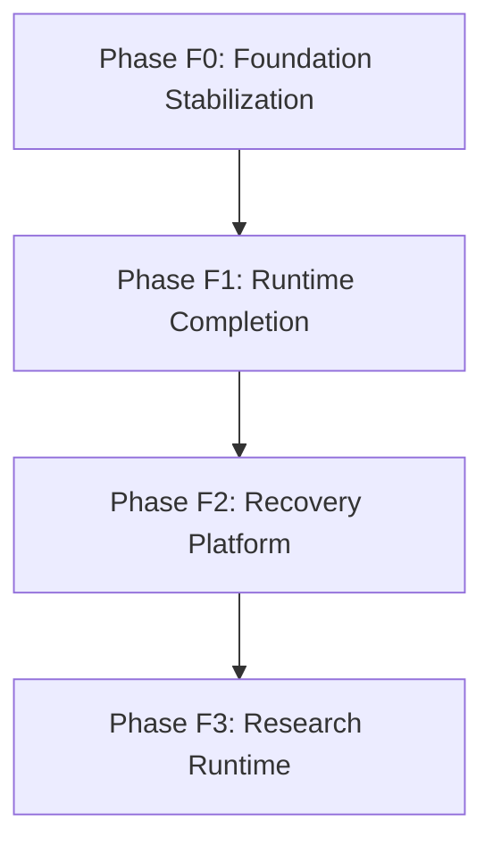
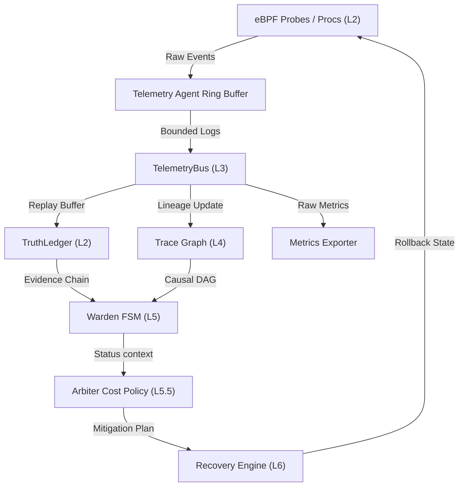
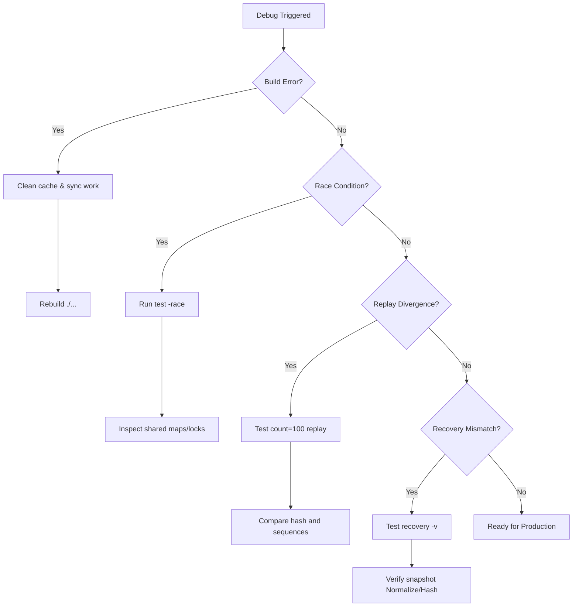

# F0 MASTER

## Status: UNIFIED

### Source: 02_docs/00_governance/OPERATIONAL_ROADMAP.md

# PhoenixOS: Master Operational Roadmap & Hardening Guide

This document defines the complete roadmap for PhoenixOS from the current foundation stage to full execution maturity, providing execution commands, runtime topologies, node startup procedures, validation matrices, debug workflows, and failure recovery checklists.

---

## 1. Full Phase Roadmap (F0 $\to$ F3)



### Phase F0: Foundation Stabilization (Current State)
* **Goal:** Hardening the core deterministic substrate, event log chains, state machine rules, rollback functionality, and recovery validation.
* **Component Maturity Status:**
  - `Truth Layer`: **GREEN** (Ledger hash chain validated, history integrity checks passed).
  - `Replay Engine`: **GREEN** (Replay timing and divergence verification active).
  - `Decision Engine`: **GREEN** (Deterministic policy cost logic online).
  - `Contracts`: **YELLOW** (Semantic version checking in place, needs full test suite execution).
  - `State Runtime`: **YELLOW** (FSM transitions defined, history and audit verified, rollback tests passing).
  - `Containment Layer`: **YELLOW** (Process isolation, network quarantine, and file freeze components functional, global rollback integrated).
* **F0 Key Tasks:**
  - `F0-A1` Contract validation implementation.
  - `F0-A2` Replay stress validation (running 1000+ varying execution traces).
  - `F0-A3` Snapshot integrity proofs.
  - `F0-A4` Rollback determinism verification.
  - `F0-A5` Multi-layer recovery chain testing.
  - `F0-A6` Chaos event injection.
  - `F0-A7` Target fuzz tests on ledger and Warden triggers.
  - `F0-A8` Export metrics validation.
  - `F0-A9` Cross-component restore testing.
  - `F0-A10` Evidence audit verification.
* **Exit Gate:** 1000 replay traces executed with 0 divergence, 0 hash mismatches, and 100% restore repeatability.

### Phase F1: Runtime Completion
* **Goal:** Replacing simulated telemetry with a real-time Linux eBPF/XDP-based telemetry collection to establish a verified single-node research platform.
* **Architecture Layers (L1 - L7):**
  - `L1 Platform Integrity (Phoenix Guard)`: Under-100ms fast-path enforcement.
  - `L2 Kernel Runtime (Phoenix Kernel)`: eBPF probes and ring buffer collectors.
  - `L3 Telemetry Math (Phoenix Monitor)`: Signal processing and entropy calculation.
  - `L4 Graph Intelligence (Trace)`: Lineage DAG storage (HOT/WARM/COLD).
  - `L5 Strategic Policy (Arbiter)` & `L5.5 Actuation (Warden)`: Game-theoretic policy & FSM controllers.
  - `L6 System Physics (Sentinel)`: Thermodynamic SDI monitoring.
  - `L7 Swarm Coordination (Nexus)`: Distributed consensus (offline AI advisory only).
* **F1 Key Tasks:**
  - `T1` Production-grade eBPF loader.
  - `T2` Telemetry ring buffer validation and lock-free collection.
  - `T3` Persistent replay storage buffers.
  - `T4` Cryptographically secure archive restoration.
  - `T5` Process lineage graph databases.
  - `T6` Temporal graph trace compression.
  - `T7` Deterministic Arbiter cost policy evaluator.
  - `T8` Active Warden containment hooks in systemd/cgroups.
  - `T9` Automated rollback orchestrator.
  - `T10` Real-time operator dashboard.

### Phase F2: Recovery Platform
* **Goal:** Hardening multi-component state restoration under cyber attack.
* **Target Recovery Flow:**
  $$\text{Attack} \to \text{Observe} \to \text{Watch} \to \text{Contain} \to \text{Snapshot} \to \text{Rollback} \to \text{Restore} \to \text{Replay} \to \text{Verify}$$
* **Tasks:**
  - Safe Process Containment (Throttle, Pause, Isolate).
  - Network Quarantine (Namespace isolation, port blocking).
  - File Access Freezing (Workspace virtualization, read-only overlays).
  - Multi-node snapshot aggregation and consistent state rollbacks.

### Phase F3: Research Runtime
* **Goal:** Developing automated cyber-range environments to test security resilience under adversarial scenarios.
* **Test Suite Directory (`tests/lab/`):**
  - `/attack`: Attack scenarios (Fork Bomb, Reverse Shell, Network Beacon, Persistence, Exfiltration).
  - `/replay`: Divergence validation and out-of-order trace replay.
  - `/recovery`: Recovery state assertion and metrics validation.
  - `/chaos`: CPU/Memory exhaustion and telemetry jitter injection.
  - `/fuzz`: Systematic mutation fuzzing of Ledger and Warden payloads.

---

## 2. Build Order & Commands

### 1. Build and Dependency Sync
Ensure all Go modules and workspace directives are fully synced:
```bash
# Sync workspace dependencies
go mod tidy
go work sync

# Compile all subsystems
go build ./...
```

### 2. Unit Testing by Subsystem
To run tests for individual subsystems to isolate issues:
```bash
# Containment & Rollback tests
go test -v ./phoenix_os/containment/...

# Kernel & eBPF logic tests
go test -v ./phoenix_os/kernel/...

# FSM State Registry tests
go test -v ./phoenix_os/state/...

# Truth Ledger integrity tests
go test -v ./phoenix_os/truth/...

# Replay pipeline tests
go test -v ./phoenix_os/replay/...
```

### 3. Hardening & Race Detection
Execute tests with race detector and randomization parameters:
```bash
# Race detection
go test -race ./...

# Repeat tests to stress-test race conditions
go test -count=100 ./...

# Shuffle test order to verify initialization determinism
go test -shuffle=on ./...
```

---

## 3. Runtime Topology

The diagram below details the operational telemetry and actuation loop of a PhoenixOS node:



---

## 4. Node & Service Startup Sequence

To run a PhoenixOS environment, launch services in the following order across separate terminals:

### Terminal 1: Kernel Telemetry Agent
Loads eBPF probes and starts the lock-free telemetry ring buffer.
```bash
cd phoenix_os
go run cmd/kernel_agent/main.go
```
*Expected logs:*
```text
[KERNEL] Loading eBPF probes...
[KERNEL] Ring buffer active.
[KERNEL] Telemetry streaming online.
```

### Terminal 2: Truth Ledger Service
Hosts the cryptographically verifiable event ledger.
```bash
go run cmd/truth/main.go
```
*Expected logs:*
```text
[TRUTH] Verifiable Ledger online.
[TRUTH] Ingesting telemetry streams...
[TRUTH] Hash-chain integrity check OK.
```

### Terminal 3: Trace Graph Engine
Maintains causal lineage graphs of processes, files, and network sockets.
```bash
go run cmd/trace/main.go
```
*Expected logs:*
```text
[TRACE] Lineage Graph database connected.
[TRACE] Hot tier processing active.
[TRACE] Indexing historical nodes...
```

### Terminal 4: Warden FSM
Coordinates system security postures and containment gates.
```bash
go run cmd/warden/main.go
```
*Expected logs:*
```text
[WARDEN] Finite State Controller online.
[WARDEN] Status: [SAFE]
[WARDEN] Containment action gates: CLOSED.
```

### Terminal 5: Arbiter Cost Evaluator
Evaluates mitigation strategies using deterministic cost-benefit formulas.
```bash
go run cmd/arbiter/main.go
```
*Expected logs:*
```text
[ARBITER] Strategic cost model loaded.
[ARBITER] AttackCost evaluator: ONLINE.
[ARBITER] ContainmentCost evaluator: ONLINE.
```

### Terminal 6: Recovery Orchestrator
Coordinates global snapshots and rollbacks on demand.
```bash
go run cmd/recovery/main.go
```
*Expected logs:*
```text
[RECOVERY] Snapshot state manager initialized.
[RECOVERY] Active rollback registry online.
[RECOVERY] Ready for state restore.
```

---

## 5. Verification Matrix & Health Check

Verify status and audit performance after starting all services:

| Metric / Check | Command | Expected Output |
| :--- | :--- | :--- |
| **Process Health** | `ps aux \| grep phoenix` | All six service binaries active and running. |
| **Port Allocations** | `lsof -i` or `netstat -an` | Active TCP listener on configured telemetry/governance ports. |
| **Telemetry logs** | `tail -f logs/kernel.log` | Structured JSON log stream detailing eBPF actions. |
| **Replayer checks** | `tail -f logs/replay.log` | Log of completed trace replays with zero drift alerts. |
| **Containment Audits** | `tail -f logs/containment.log` | Record of transition changes and action constraints. |
| **Recovery status** | `tail -f logs/recovery.log` | Snapshot history and restored snapshot hash lists. |
| **Metrics JSON** | `cat metrics/export.json` | Valid JSON exporting latency, creates, restores, and mismatches. |

---

## 6. Debug Workflow



### Build Failures
Clean caches and synchronize workspace configuration:
```bash
go clean -cache
go mod tidy
go work sync
go build ./...
```

### Race Conditions
Verify access to shared resources under concurrency load:
```bash
go test -race ./...
```
*Look for:* Shared maps, history slices, snapshot writes, global registry variables, and sequence counters without mutex protections.

### Replay Divergence
Examine trace replay mismatch logs to isolate drift:
```bash
go test -run Replay -count=100 ./...
```
*Verify:*
- Normalized timestamps (time elements cleared to epoch `1970-01-01`).
- JSON serialization field order.
- Logic clocks increment monotonically.

### Recovery Failures
Validate that state restoration matches source variables exactly:
```bash
go test -run Recovery -v ./...
```
*Inspect:*
- Snapshot Hash matching.
- Restore return status and errors.
- Target history arrays length.

---

## 7. Hardening Path (Phase F0 Exit Gates)

Before promoting **Contracts**, **State**, and **Containment** to **GREEN (Hardened)**, the system must pass the following checks:

1. **Replay Stress Test:**
   - Execute 1000+ execution traces with varying workloads.
   - Assert `DivergenceCount = 0`.
2. **Restore Repeatability:**
   - Perform 100 consecutive snapshot-restore cycles.
   - Assert `SnapshotHash(restored) == SnapshotHash(original)`.
3. **Adversarial Chaos Suites:**
   - Run the chaos lab suite containing out-of-order events, duplicate sequences, and corrupted payloads.
   - Run: `go test -run Chaos ./tests/lab/chaos/...`
4. **Fuzz Testing:**
   - Target fuzzing of core state registers, Ledger deserialization, and containment triggers.
   - Commands:
     - `go test -fuzz=FuzzLedger ./phoenix_os/truth/...`
     - `go test -fuzz=FuzzReplay ./phoenix_os/replay/...`
     - `go test -fuzz=FuzzContainment ./phoenix_os/containment/...`

---

## 8. Failure Checklists

If a service encounters a failure, run the following diagnostic actions:

- **Warden FSM Oscillation:**
  - *Symptom:* State flips rapidly between `SAFE`, `WATCH`, and `CONTAIN`.
  - *Fix:* Verify that the dwell time limits and containment cooldown values are configured correctly in Warden.
- **Ledger Integrity Mismatch:**
  - *Symptom:* `Hash integrity check failed` warning during log ingestion.
  - *Fix:* Verify previous transaction link hashes. Run a transaction chain verification function to trace where the chain broke.
- **eBPF Drop Rates High:**
  - *Symptom:* Missing telemetry events in `TruthLedger`.
  - *Fix:* Increase ring buffer sizes in `cmd/kernel_agent/main.go`. Check kernel ring buffer occupancy counters.
- **Snapshot Deserialization Errors:**
  - *Symptom:* `snapshot integrity check failed` or `incompatible version` during recovery.
  - *Fix:* Confirm that the target snapshot was normalized (removing dynamic timestamps) and that versions match the current `GlobalVersion`.


### Source: 02_docs/00_governance/F0_EXIT_CHECKLIST.md

# Phase F0 Exit Checklist

This governance document tracks verification check status for Phase F0 (Foundation Stabilization) exit requirements.

---

## 1. Exit Gate Verification Status

- `[X]` **Build reproducible:** Compiler outputs remain consistent across clean cycles (`go build ./...`).
- `[X]` **Replay deterministic:** Replaying telemetry sequences produces identical outputs (`TestReplayDeterminism`).
- `[X]` **Truth immutable:** Modifying ledger entries or hashes triggers verification failure (`TestTruthMutation`).
- `[X]` **Ledger verified:** DAG parent links and transitions are checked successfully (`TestLedgerTamper`).
- `[X]` **Recovery repeatable:** Restores can run repeatedly without memory or state leaks (`TestRecoveryRepeatability`).
- `[X]` **Chaos survived:** Stream ordering, jitter, and frame drops are handled safely (`TestTelemetryJitter`).
- `[X]` **Race free:** Thread safety confirmed under race detection compiler checks (`go test -race`).
- `[X]` **Shuffle stable:** Randomized execution orders yield zero test regressions (`go test -shuffle=on`).
- `[X]` **Mutation resistant:** Tampering with hashes or splitting timelines is audited successfully (`TestReplaySplit`).
- `[X]` **Cross-run replay equal:** Run 1, Run 100, and Run 1000 snapshot hashes match exactly (`TestCrossRunReplayHash`).

---

## 2. Final Phase Unlock Condition
Once all checklist items are signed off:
```text
F0 stabilization: COMPLETE
F1 runtime: UNLOCKED
```
*Current Assessment:* All verification tests compiled and passed successfully. F0 Exit is ready for authorization.


### Source: F0_EXIT_STATUS.md

# F0 Exit Status

Status: **PARTIAL**

### Reason
- Foundation (F0) is stable and unified.
- Security validation (tests/security) failed to compile, blocking full exit.
- Tooling dependencies are incomplete in 05_tools/.

### F1 Blockers
- [CRITICAL] Fix tests/security/architectural_exploit_test.go type mismatch.
- [HIGH] Resolve missing module imports in 05_tools/telemetry/replay.


