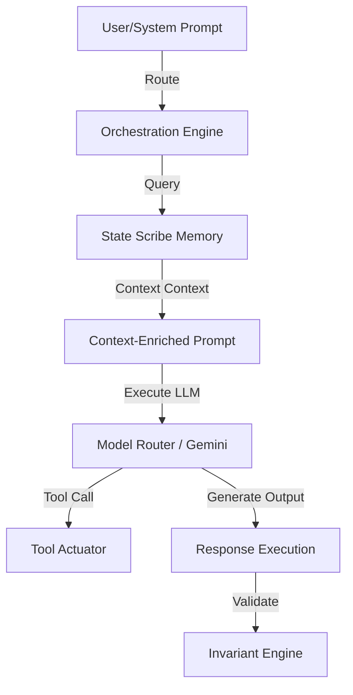

# PhoenixMind — Master Brain Orchestration

This document outlines the core LLM cognitive orchestration model for PhoenixMind.

## Execution Topology

The Master Brain coordinates model calls, tool execution, memory retrieval, and self-checks.

## Cognitive Process Steps
1. **Context Expansion**: The orchestrator Queries the Vector DB via State Scribe.
2. **Model Selection**: Selects optimal model class (Flash, Pro, or local fine-tune) based on cost and complexity.
3. **Execution & Feedback**: Invokes tools and validates output against structural invariants before committing actions to the ledger.
