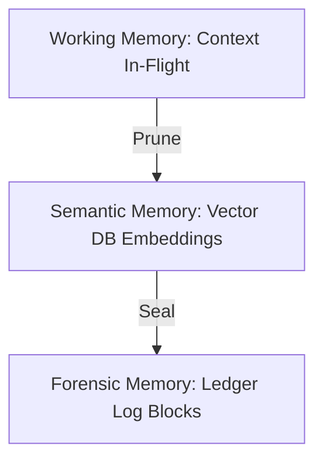

# PhoenixMind — Memory Model

Describes the partitioning of knowledge within the cognitive loop.

## Memory Classes

1. **Episodic Memory**: Raw logs of execution runs (what occurred and when).
2. **Semantic Memory**: Knowledge base containing libraries, system specifications, and tool contracts.
3. **Working Memory**: In-context task tracker mapping the current step inside execution plans.

## Storage Hierarchy

