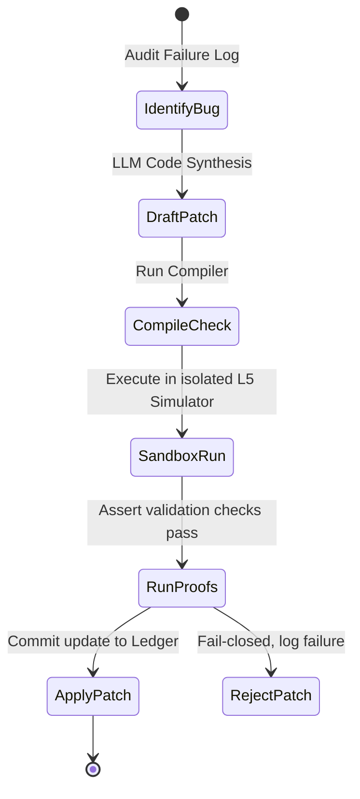

# PhoenixMind — Self-Evolution Model

Specifies the framework for safe self-directed code patching and model improvement.

## Self-Correction Loop

```mermaid
stateDiagram-v2
    [*] --> IdentifyBug: Audit Failure Log
    IdentifyBug --> DraftPatch: LLM Code Synthesis
    DraftPatch --> CompileCheck: Run Compiler
    CompileCheck --> SandboxRun: Execute in isolated L5 Simulator
    SandboxRun --> RunProofs: Assert validation checks pass
    RunProofs --> ApplyPatch: Commit update to Ledger
    RunProofs --> RejectPatch: Fail-closed, log failure
    ApplyPatch --> [*]
```
