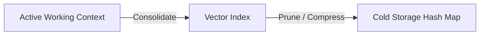

# State Scribe — Memory Lifecycle

Outlines how memory blocks are created, stored, and reclaimed.

```mermaid
graph LR
    Active[Active Working Context] -->|Consolidate| Semantic[Vector Index]
    Semantic -->|Prune / Compress| Archive[Cold Storage Hash Map]
```
