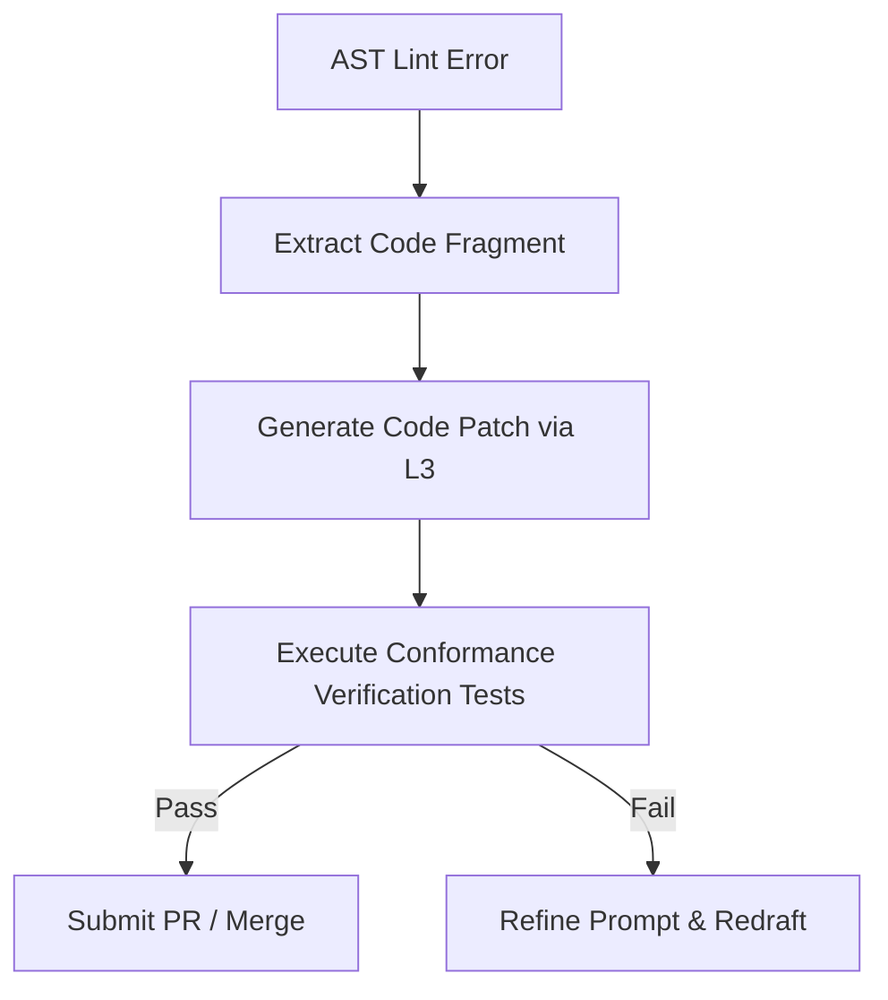

# Workflow — Code Intelligence

Coordinates code analysis and repair:

```mermaid
graph TD
    Trigger[AST Lint Error] --> Parse[Extract Code Fragment]
    Parse --> ModelCall[Generate Code Patch via L3]
    ModelCall --> ValidationRun[Execute Conformance Verification Tests]
    ValidationRun -->|Pass| Commit[Submit PR / Merge]
    ValidationRun -->|Fail| Redraft[Refine Prompt & Redraft]
```
