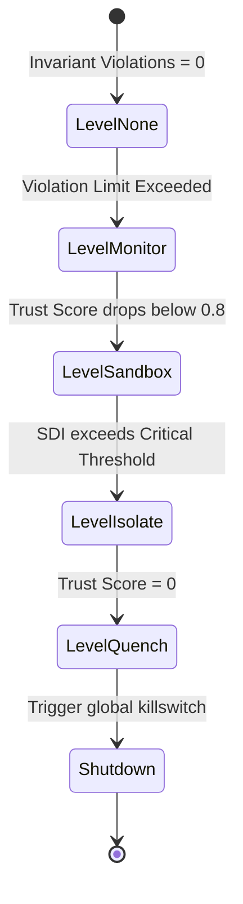

---\nStatus: Implemented\nImplementation: 100%\nConfidence: Proven\n---\n# Security — Control Flow

> Last verified: 2026-06-04

Defines the escalation states of system containment policies.

## Escalation Control Logic

