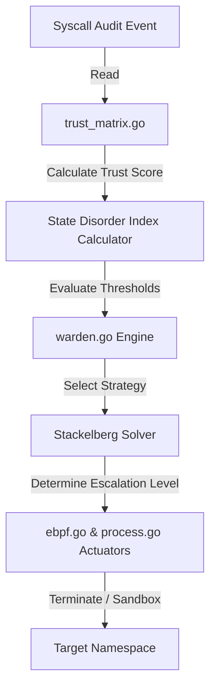

---\nStatus: Implemented\nImplementation: 100%\nConfidence: Proven\n---\n# Security — Data Flow

> Last verified: 2026-06-04

This document defines violation and containment control flow data paths.

## Containment Decision Flow

## Violation Forensic Log Flow
- Security violations are passed to `jsonl_writer.go`.
- The writer creates JSONL-structured logs describing event IDs, violation signatures, and timestamps.
