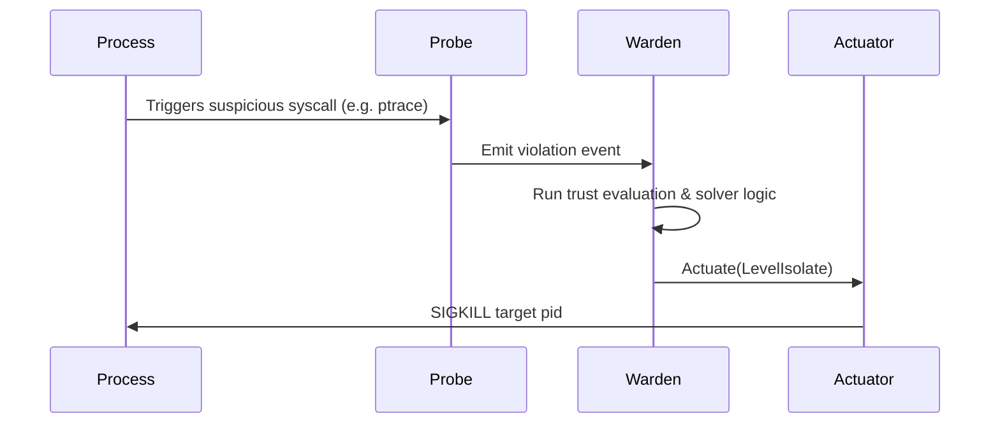

---\nStatus: Implemented\nImplementation: 100%\nConfidence: Proven\n---\n# Security — Event Flow

> Last verified: 2026-06-04

```mermaid
sequenceDiagram
    participant Process
    participant Probe
    participant Warden
    participant Actuator

    Process->>Probe: Triggers suspicious syscall (e.g. ptrace)
    Probe->>Warden: Emit violation event
    Warden->>Warden: Run trust evaluation & solver logic
    Warden->>Actuator: Actuate(LevelIsolate)
    Actuator->>Process: SIGKILL target pid
```
