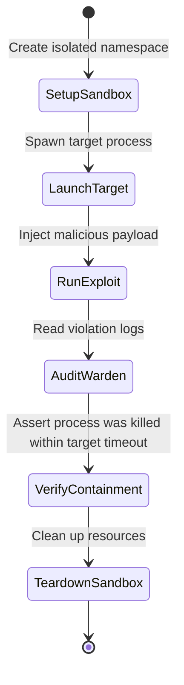

---\nStatus: Implemented\nImplementation: 100%\nConfidence: Proven\n---\n# Validation — Control Flow

> Last verified: 2026-06-04

Defines the execution flow of the validation sandbox and tests runner.

## Exploit Simulation Control Flow

