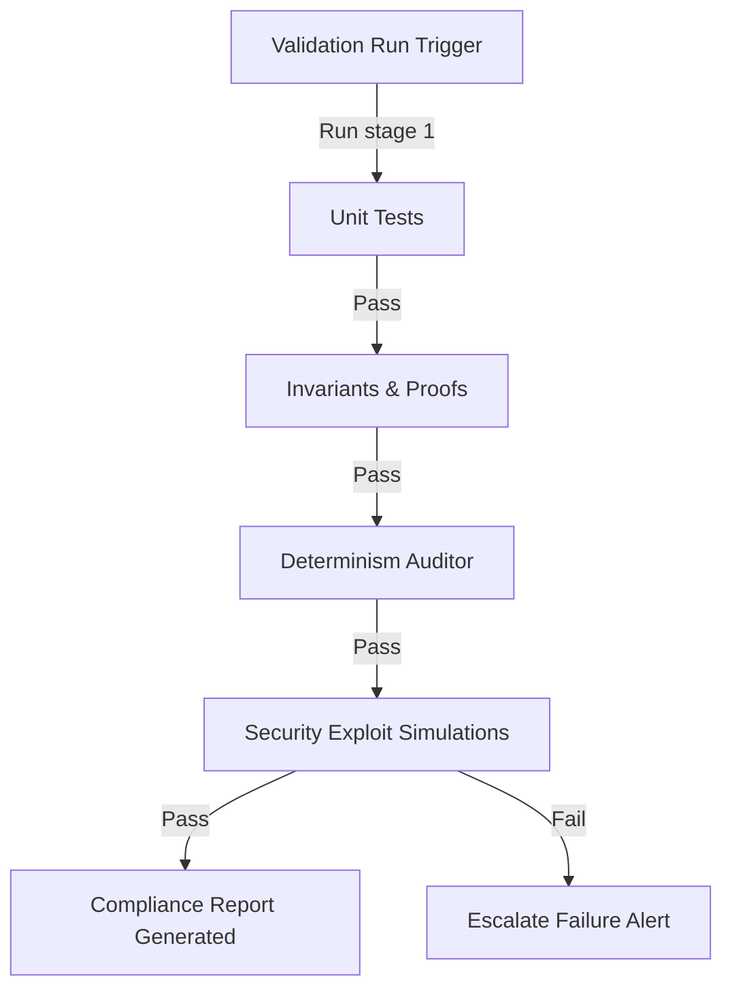

---\nStatus: Implemented\nImplementation: 100%\nConfidence: Proven\n---\n# Validation — Data Flow

> Last verified: 2026-06-04

This document defines the validation verification flows.

## Staged Verification Pipeline Flow

## Audit Log Assertion Flow
- Test orchestrators parse output JSON logs from the kernel telemetry.
- Assertions verify that event causality maps correctly to ledger hashes.
