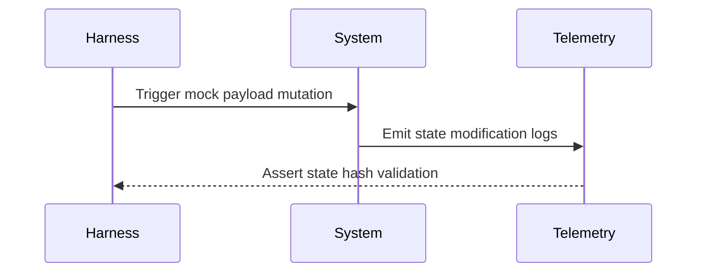

---\nStatus: Implemented\nImplementation: 100%\nConfidence: Proven\n---\n# Validation — Event Flow

> Last verified: 2026-06-04

Validation components monitor state validation events.

```mermaid
sequenceDiagram
    participant Harness
    participant System
    participant Telemetry

    Harness->>System: Trigger mock payload mutation
    System->>Telemetry: Emit state modification logs
    Telemetry-->>Harness: Assert state hash validation
```
