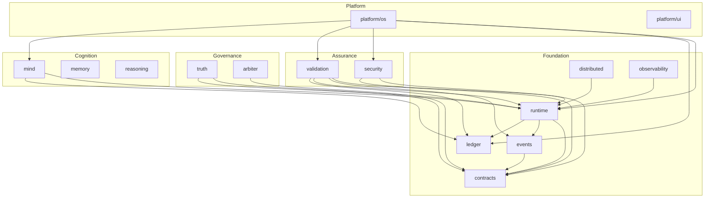

---\nStatus: Implemented\nImplementation: 100%\nConfidence: Proven\n---\n# Phoenix Master System Map

> Authoritative map of all layers, subprojects, and dependency edges.
> Last verified: 2026-06-04

## Layer Hierarchy

```
┌─────────────────────────────────────────────────┐
│                    PLATFORM                      │
│         os · ui · cli · dashboard                │
├─────────────────────────────────────────────────┤
│                    COGNITION                     │
│      mind · memory · reasoning · reflection      │
├─────────────────────────────────────────────────┤
│                   GOVERNANCE                     │
│              truth · arbiter                     │
├─────────────────────────────────────────────────┤
│                   ASSURANCE                      │
│           validation · security                  │
├─────────────────────────────────────────────────┤
│                  FOUNDATION                      │
│  contracts · events · runtime · ledger ·         │
│  distributed · observability                     │
└─────────────────────────────────────────────────┘

         ↑ Dependencies flow UPWARD only ↑
```

## Import Direction Rules

| Rule | Description |
|------|-------------|
| **DIR-001** | Foundation may NOT import from any higher layer |
| **DIR-002** | Assurance may import Foundation only |
| **DIR-003** | Governance may import Foundation and Assurance |
| **DIR-004** | Cognition may import Foundation, Assurance, Governance |
| **DIR-005** | Platform may import any lower layer |
| **DIR-006** | Contracts may NOT import any implementation package |
| **DIR-007** | No circular dependencies across bounded contexts |

## Dependency Graph



## Module Boundaries (go.work)

| Module | Path | Layer |
|--------|------|-------|
| `phoenix/foundation/contracts` | `./foundation/contracts` | Foundation |
| `phoenix/foundation/events` | `./foundation/events` | Foundation |
| `phoenix/foundation/runtime` | `./foundation/runtime` | Foundation |
| `phoenix/foundation/ledger` | `./foundation/ledger` | Foundation |
| `phoenix/foundation/distributed` | `./foundation/distributed` | Foundation |
| `phoenix/foundation/observability` | `./foundation/observability` | Foundation |
| `phoenix/foundation/runtime/kernel` | `./foundation/runtime/kernel` | Foundation |
| `phoenix/assurance/validation` | `./assurance/validation` | Assurance |
| `phoenix/assurance/security` | `./assurance/security` | Assurance |
| `phoenix/governance/truth` | `./governance/truth` | Governance |
| `phoenix/governance/arbiter` | `./governance/arbiter` | Governance |
| `phoenix/cognition` | `./cognition` | Cognition |
| `phoenix/cognition/mind` | `./cognition/mind` | Cognition |
| `phoenix/platform/os` | `./platform/os` | Platform |
| `phoenix/platform/ui/service` | `./platform/ui/Service` | Platform |
| `phoenix/contract-tests` | `./contract-tests` | Assurance |
| `phoenix/labs/crucible` | `./labs/crucible` | Labs |

## Cross-Cutting Concerns

| Concern | Owner | Touches |
|---------|-------|---------|
| Event schema | contracts | events, runtime, validation, platform |
| Security policy | contracts | security, runtime, guard, platform |
| Replay semantics | contracts | runtime, validation, ledger |
| Observability | observability | runtime, platform |
| Truth verification | truth | validation, arbiter, ledger |

---
*See [MASTER_DEPENDENCY_MAP.md](./MASTER_DEPENDENCY_MAP.md) for the machine-readable dependency matrix.*
*See [MASTER_SUBPROJECT_INDEX.md](./MASTER_SUBPROJECT_INDEX.md) for the complete subproject inventory.*
