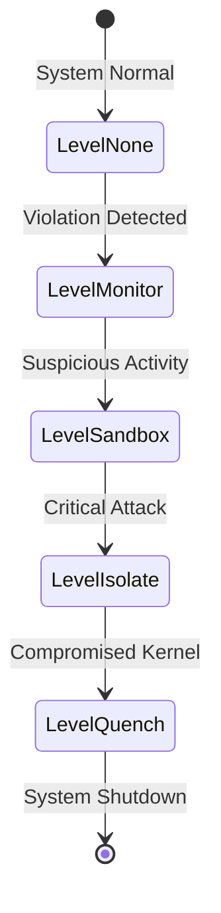

---\nStatus: Implemented\nImplementation: 100%\nConfidence: Proven\n---\n# Contracts — Control Flow

> Last verified: 2026-06-04

Contracts enforce state transition invariants across layers. This document details the control flow pathways defined by these contracts.

## Containment Escalation Control Flow

The `Actuator` interface manages the containment ladder using the following control flow path:

## State Control Rules

1. **Escalation Invariant**: Transitions must proceed sequentially unless a `StateCritical` event triggers a direct jump to `LevelIsolate`.
2. **Authority Verification**: Any call to `Actuator.Actuate()` must be backed by a valid signature verified against the `Event` contract.
3. **Execution Safety**: If an actuator fails to transition, it must fail-closed, reverting the environment to `LevelQuench`.
