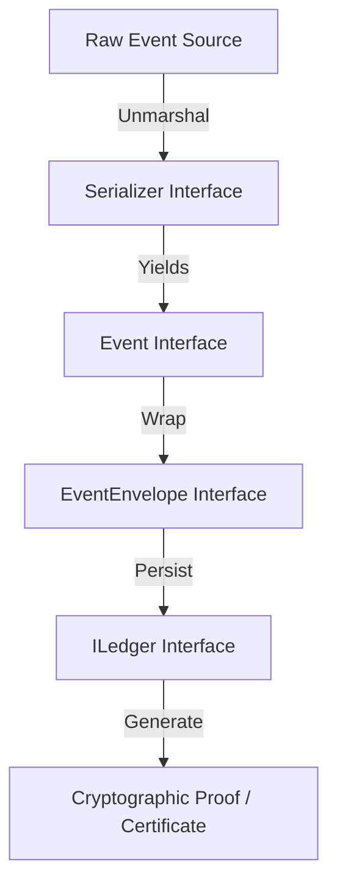

---\nStatus: Implemented\nImplementation: 100%\nConfidence: Proven\n---\n# Contracts — Data Flow

> Last verified: 2026-06-04

This document defines the interface boundaries for data passing through the contracts layer.

## Data Flow Diagram

## Boundary Contracts

1. **Ingest Boundary**
   - Raw bytes are passed to the `Serializer.Unmarshal()` function, which produces a concrete instance implementing the `Event` interface.
   - The system validates signatures and logical time order before wrapping it inside an `EventEnvelope`.

2. **Persistence Boundary**
   - The `ILedger.AddEntryV2()` method accepts event parameters and commits them to the ledger.
   - The `ILedger.GenerateCertificate()` method generates a byte slice representing cryptographic proof of ledger persistence.

3. **Replay Boundary**
   - The `ReplayEngine` accepts a slice of `EventEnvelope` items.
   - The `Reconstructor` processes these envelopes to produce a `Snapshot` interface.
