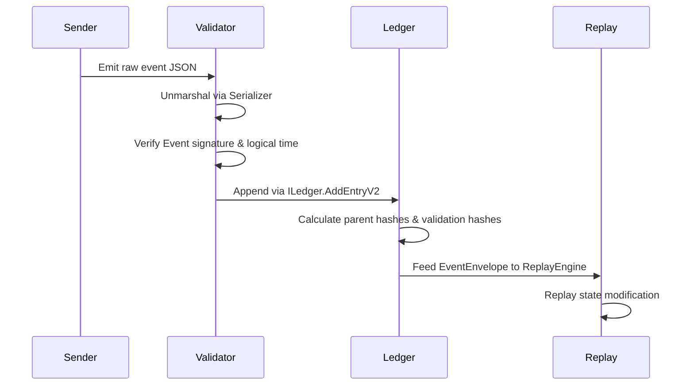

---\nStatus: Implemented\nImplementation: 100%\nConfidence: Proven\n---\n# Contracts — Event Flow

> Last verified: 2026-06-04

This document defines the lifecycle flow of events through the contracts interfaces.

## Event Processing Pipeline

## Guarantees

1. **Causal Ordering**: Every event envelope has a parent event hash. Replay engines process events chronologically using logical timestamps.
2. **Non-repudiation**: Events must contain signatures that match the authority ID.
