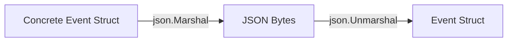

---\nStatus: Implemented\nImplementation: 100%\nConfidence: Proven\n---\n# Events — Data Flow

> Last verified: 2026-06-04

This document describes how events are marshaled and validated.

## Serialization Data Flow

## Envelope Data Flow
- When an event is transmitted or saved, the event attributes map directly to JSON tags:
  - `event_id`
  - `parent_id`
  - `authority_id`
  - `logical_time`
  - `evidence`
  - `signature`
  - `payload`
