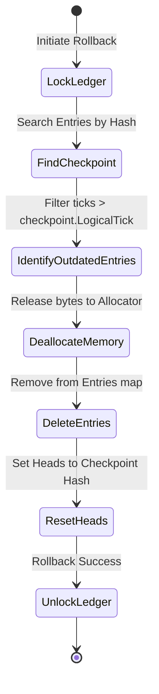

---\nStatus: Implemented\nImplementation: 100%\nConfidence: Proven\n---\n# Ledger — Control Flow

> Last verified: 2026-06-04

Enforces transaction safety through write locks and rollback states.

## Rollback Control Flow

