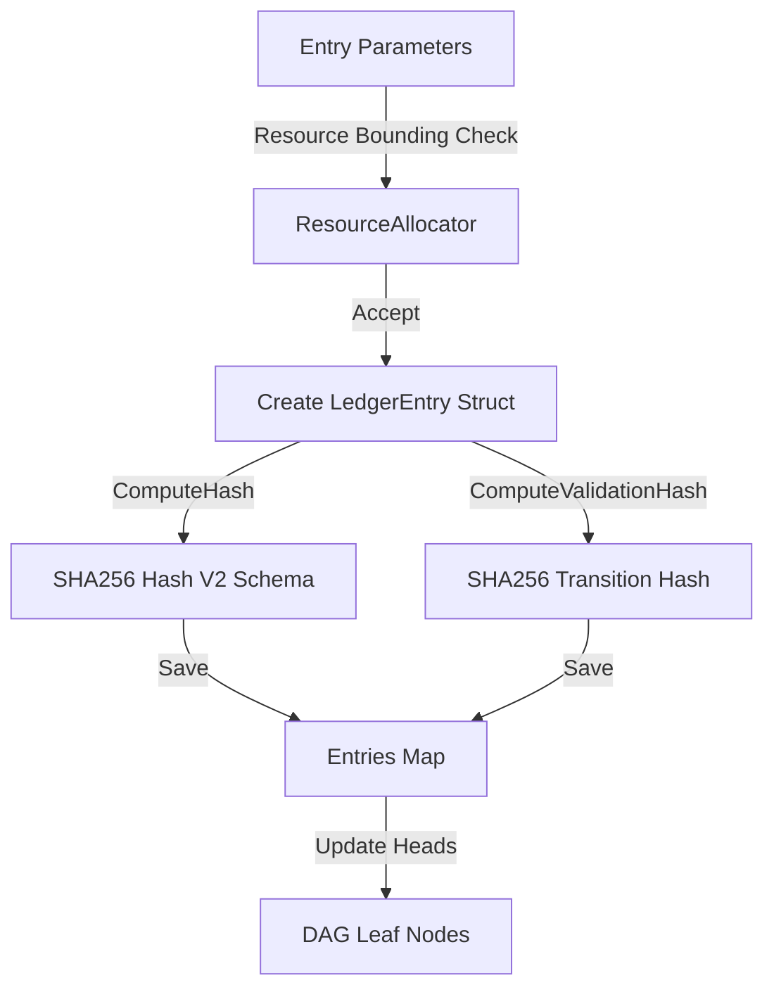

---\nStatus: Implemented\nImplementation: 100%\nConfidence: Proven\n---\n# Ledger — Data Flow

> Last verified: 2026-06-04

This document defines event appending and validation hashing flows inside the ledger.

## Append and Validation Flow

## Linear Parent Verification Flow
- When `Verify()` is called, the ledger traverses all entries.
- For each entry, it recomputes the Hash and ValidationHash.
- It asserts that `entry.StateBefore` matches `parent.StateAfter` to prevent state transition gaps.
