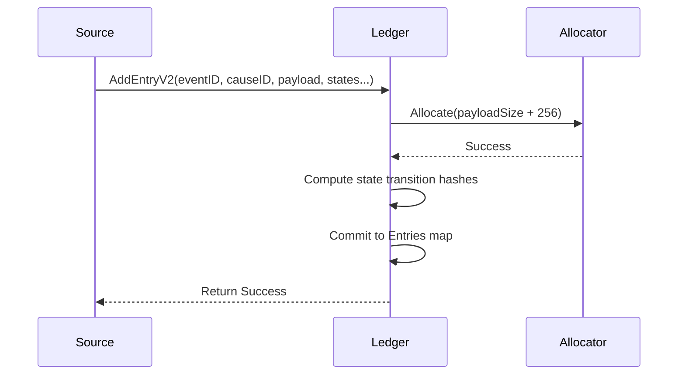

---\nStatus: Implemented\nImplementation: 100%\nConfidence: Proven\n---\n# Ledger — Event Flow

> Last verified: 2026-06-04

```mermaid
sequenceDiagram
    participant Source
    participant Ledger
    participant Allocator

    Source->>Ledger: AddEntryV2(eventID, causeID, payload, states...)
    Ledger->>Allocator: Allocate(payloadSize + 256)
    Allocator-->>Ledger: Success
    Ledger->>Ledger: Compute state transition hashes
    Ledger->>Ledger: Commit to Entries map
    Ledger-->>Source: Return Success
```
