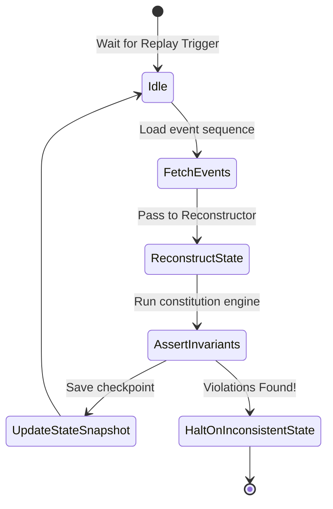

---\nStatus: Implemented\nImplementation: 100%\nConfidence: Proven\n---\n# Runtime — Control Flow

> Last verified: 2026-06-04

Describes runtime transaction validation, consensus iterations, and replay loops.

## Replay Loop Control Flow

