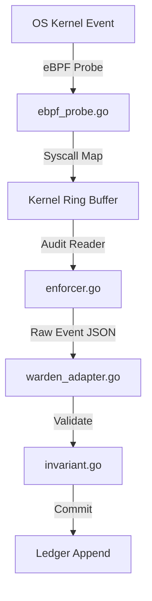

---\nStatus: Implemented\nImplementation: 100%\nConfidence: Proven\n---\n# Runtime — Data Flow

> Last verified: 2026-06-04

This document defines how trace events from the OS kernel become verified ledger facts.

## Sycall Auditing and Ingest Pipeline

## Consensus Message Flow
- Consensus nodes receive proposed blocks containing sequence indices.
- Proposers sign block proposals.
- Receivers verify signatures, evaluate transaction proofs via `validator.go`, and vote.
- Once a quorum of votes is reached, the block is finalized and indexed.
