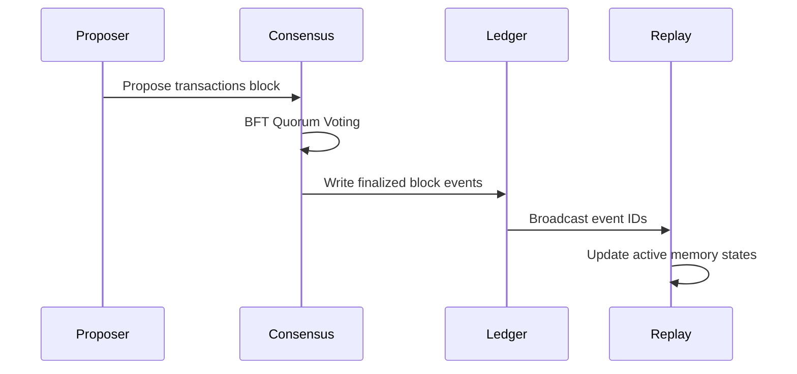

---\nStatus: Implemented\nImplementation: 100%\nConfidence: Proven\n---\n# Runtime — Event Flow

> Last verified: 2026-06-04

Coordinates event propagation through consensus nodes and replay executors.

