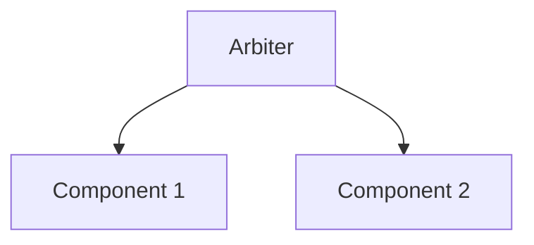

---\nStatus: Planned\nImplementation: 15%\nConfidence: Conceptual\n---\n# Arbiter — System Map

> Components, relationships, and internal architecture.

## Component Overview

<!-- TODO: Document each major component/package in this subproject -->

| Component | Purpose | Status |
|-----------|---------|--------|
| *Pending audit* | | |

## Internal Dependencies

## External Dependencies

| Dependency | Direction | Purpose |
|------------|-----------|---------|
| *Pending audit* | | |

## Key Interfaces

<!-- TODO: List the primary exported types/functions -->

---
*Part of [Arbiter docs](./) | [Master System Map](../../docs/MASTER_SYSTEM_MAP.md)*
