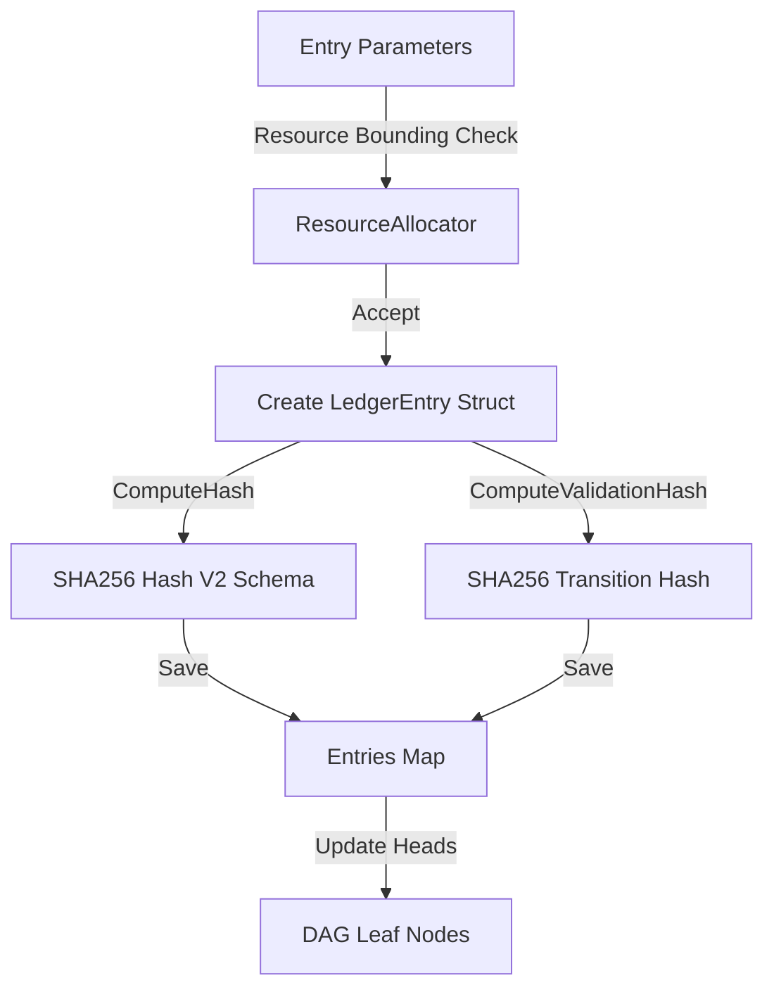

---\nStatus: Implemented\nImplementation: 100%\nConfidence: Proven\n---\n# Ledger — Data Flow

> Last verified: 2026-06-04

This document defines event appending and validation hashing flows inside the ledger.

## Append and Validation Flow

## PENDING/COMPLETION Chaining
To support asynchronous enforcement (e.g., process containment) while maintaining bit-perfect forensic integrity, the Ledger uses an intent-outcome pairing:

1.  **PENDING (Intent):** Recorded synchronously during `ActuateRequest`. Establishes the authority to actuate.
2.  **COMPLETION (Outcome):** Appended asynchronously by the Actuator Drain. Links back to the intent via `CauseID` and records the final `CONFIRMED` or `FAILED` status.

## Sovereign Payload Schema (v1)
All Warden forensic events use a fixed-size 43-byte binary payload to ensure bit-perfect cross-platform hashing and zero-allocation processing.

| Offset | Field | Description |
| :--- | :--- | :--- |
| `0x00` | Version | Current schema version (`0x01`). |
| `0x01` | Flags | Bit0: Shadow, Bit1: Override. |
| `0x02` | Class | Actuation class enum (1:LOG...6:KILL). |
| `0x03` | StateBefore | FSM state before transition. |
| `0x04` | ShadowState | Evaluated evaluative state. |
| `0x05-0x08` | PID | Target PID (BE, host namespace). |
| `0x09` | Status | 0:PENDING, 1:CONFIRMED, 2:FAILED. |
| `0x0A-0x2A` | PolicyHash | SHA-256 of active redlines. |

## DAG Verification Flow
- When `Verify()` is called, the ledger performs a full cryptographic audit.
- It recomputes hashes using `uint64` length-prefixing for structural immunity.
- It asserts causal continuity: `entry.StateBefore` MUST match `parent.StateAfter`.
- Replay Engine uses **Kahn's Algorithm** with a deterministic `(Tick, EventID)` tie-breaker for DAG topological sort.
